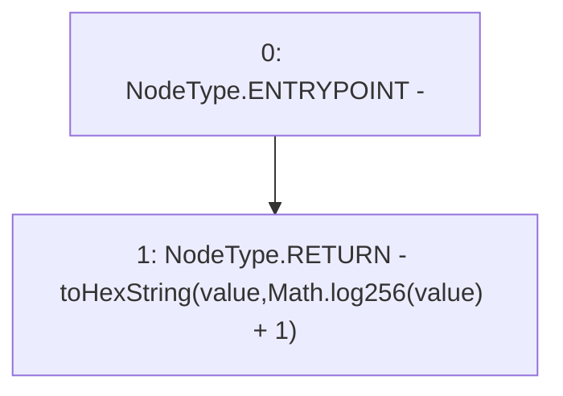

# Context: Strings.toHexString

**Contract:** `Strings` (Inherits: None)
**Signature:** `toHexString(uint256) returns (string)`
**Method Selector ID:** `Internal (No Method ID)`
**Visibility:** `internal`
**Environment-Free:** `Yes`
**Modifiers:** None

### State Variables Interaction
- **Reads:** None
- **Writes:** None

### Environment & Verification Flags
- **Uses Foundry Cheatcodes:** No
- **Has Echidna Properties:** No

### Internal Calls Tree
- None

### External Calls / Value Transfers
- `Math.TMP_235(uint256) = LIBRARY_CALL, dest:Math, function:Math.log256(uint256), arguments:['value'] `

### Control Flow Graph (CFG)


### Source Mapping
Declared in: `certora-ac-datasets/detasets/web3bugs/dataset/web3bugs/52/node_modules/@openzeppelin/contracts/utils/Strings.sol` on lines **51** to **55**

```solidity
    function toHexString(uint256 value) internal pure returns (string memory) {
        unchecked {
            return toHexString(value, Math.log256(value) + 1);
        }
    }

```
