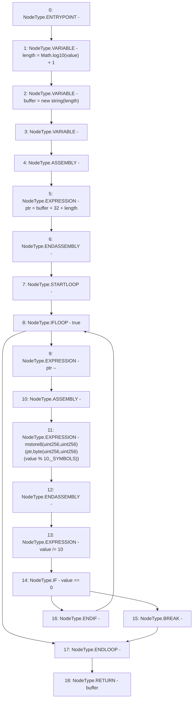

# Context: Strings.toString

**Contract:** `Strings` (Inherits: None)
**Signature:** `toString(uint256) returns (string)`
**Method Selector ID:** `Internal (No Method ID)`
**Visibility:** `internal`
**Environment-Free:** `Yes`
**Modifiers:** None

### State Variables Interaction
- **Reads:** _SYMBOLS
- **Writes:** None

### Environment & Verification Flags
- **Uses Foundry Cheatcodes:** No
- **Has Echidna Properties:** No

### Internal Calls Tree
- None

### External Calls / Value Transfers
- `Math.TMP_215(uint256) = LIBRARY_CALL, dest:Math, function:Math.log10(uint256), arguments:['value'] `

### Control Flow Graph (CFG)


### Source Mapping
Declared in: `certora-ac-datasets/detasets/web3bugs/dataset/web3bugs/52/node_modules/@openzeppelin/contracts/utils/Strings.sol` on lines **19** to **39**

```solidity
    function toString(uint256 value) internal pure returns (string memory) {
        unchecked {
            uint256 length = Math.log10(value) + 1;
            string memory buffer = new string(length);
            uint256 ptr;
            /// @solidity memory-safe-assembly
            assembly {
                ptr := add(buffer, add(32, length))
            }
            while (true) {
                ptr--;
                /// @solidity memory-safe-assembly
                assembly {
                    mstore8(ptr, byte(mod(value, 10), _SYMBOLS))
                }
                value /= 10;
                if (value == 0) break;
            }
            return buffer;
        }
    }

```
