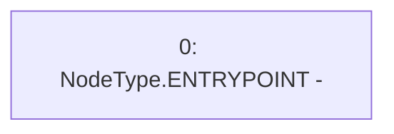

# Context: SwapQueue._insertQueue

**Contract:** `SwapQueue` (Inherits: ProtocolConstants, ISwapQueue)
**Signature:** `_insertQueue(uint256) returns (bool)`
**Method Selector ID:** `Internal (No Method ID)`
**Visibility:** `internal`
**Environment-Free:** `Yes`
**Modifiers:** None

### State Variables Interaction
- **Reads:** None
- **Writes:** None

### Environment & Verification Flags
- **Uses Foundry Cheatcodes:** No
- **Has Echidna Properties:** No

### Internal Calls Tree
- None

### External Calls / Value Transfers
- None

### Control Flow Graph (CFG)


### Source Mapping
Declared in: `certora-ac-datasets/detasets/web3bugs/dataset/web3bugs/52/contracts/dex/queue/SwapQueue.sol` on lines **30** to **30**

```solidity
    function _insertQueue(uint256 value) internal returns (bool) {}

```
