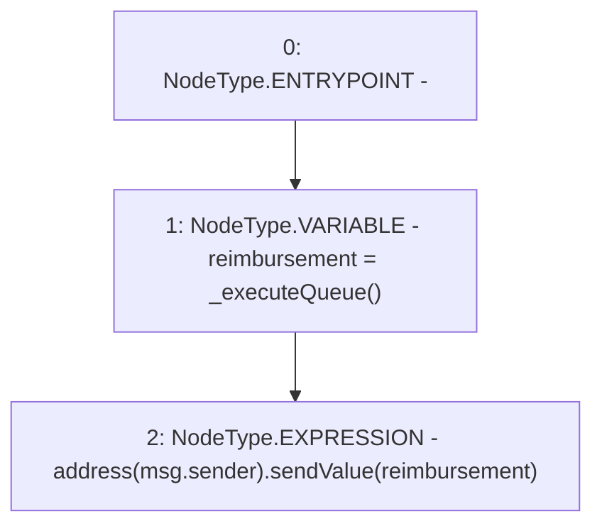

# Context: SwapQueue.executeQueue

**Contract:** `SwapQueue` (Inherits: ProtocolConstants, ISwapQueue)
**Signature:** `executeQueue()`
**Method Selector ID:** `0xa4ec6938`
**Visibility:** `external`
**Environment-Free:** `No (reads EVM state context)`
**Modifiers:** None

### State Variables Interaction
- **Reads:** None
- **Writes:** None

### Environment & Verification Flags
- **Uses Foundry Cheatcodes:** No
- **Has Echidna Properties:** No

### Internal Calls Tree
- None

### External Calls / Value Transfers
- `Address.LIBRARY_CALL, dest:Address, function:Address.sendValue(address,uint256), arguments:['TMP_30', 'reimbursement'] `

### Control Flow Graph (CFG)


### Source Mapping
Declared in: `certora-ac-datasets/detasets/web3bugs/dataset/web3bugs/52/contracts/dex/queue/SwapQueue.sol` on lines **22** to **25**

```solidity
    function executeQueue() external {
        uint256 reimbursement = _executeQueue();
        payable(msg.sender).sendValue(reimbursement);
    }

```
