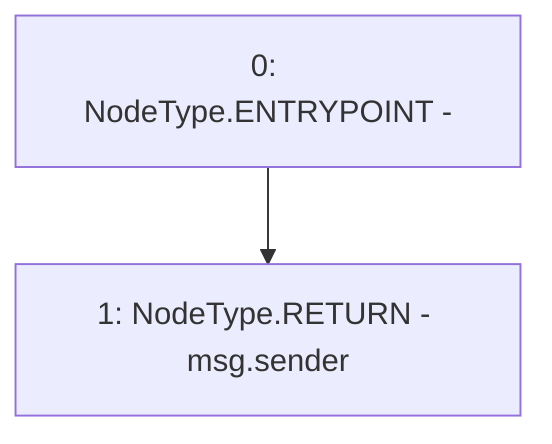

# Context: SynthFactory._msgSender

**Contract:** `SynthFactory` (Inherits: Ownable, Context, ProtocolConstants, ISynthFactory)
**Signature:** `_msgSender() returns (address)`
**Method Selector ID:** `Internal (No Method ID)`
**Visibility:** `internal`
**Environment-Free:** `No (reads EVM state context)`
**Modifiers:** None

### State Variables Interaction
- **Reads:** None
- **Writes:** None

### Environment & Verification Flags
- **Uses Foundry Cheatcodes:** No
- **Has Echidna Properties:** No

### Internal Calls Tree
- None

### External Calls / Value Transfers
- None

### Control Flow Graph (CFG)


### Source Mapping
Declared in: `certora-ac-datasets/detasets/web3bugs/dataset/web3bugs/52/node_modules/@openzeppelin/contracts/utils/Context.sol` on lines **17** to **19**

```solidity
    function _msgSender() internal view virtual returns (address) {
        return msg.sender;
    }

```
