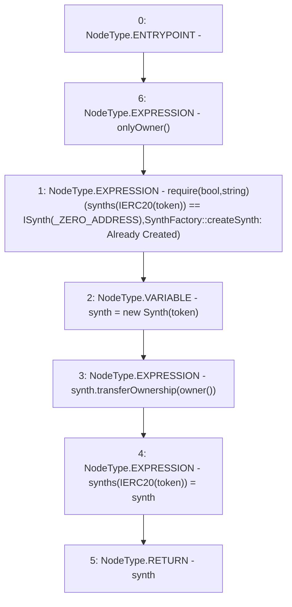

# Context: SynthFactory.createSynth

**Contract:** `SynthFactory` (Inherits: Ownable, Context, ProtocolConstants, ISynthFactory)
**Signature:** `createSynth(IERC20Extended) returns (ISynth)`
**Method Selector ID:** `0xcf62480d`
**Visibility:** `external`
**Environment-Free:** `No (reads EVM state context)`
**Modifiers:**
- `onlyOwner`
  ```solidity
  modifier onlyOwner() {
          _checkOwner();
          _;
      }
  ```

### State Variables Interaction
- **Reads:** _ZERO_ADDRESS, synths
- **Writes:** synths

### Assertion Checks & Business Requirements
- require/assert: `require(bool,string)(synths[IERC20(token)] == ISynth(_ZERO_ADDRESS),SynthFactory::createSynth: Already Created)`

### Environment & Verification Flags
- **Uses Foundry Cheatcodes:** No
- **Has Echidna Properties:** No

### Internal Calls Tree
- None

### External Calls / Value Transfers
- `Synth.HIGH_LEVEL_CALL, dest:synth(Synth), function:transferOwnership, arguments:['TMP_205']  `

### Control Flow Graph (CFG)


### Source Mapping
Declared in: `certora-ac-datasets/detasets/web3bugs/dataset/web3bugs/52/contracts/dex-v2/synths/SynthFactory.sol` on lines **20** to **38**

```solidity
    function createSynth(IERC20Extended token)
        external
        override
        onlyOwner
        returns (ISynth)
    {
        require(
            synths[IERC20(token)] == ISynth(_ZERO_ADDRESS),
            "SynthFactory::createSynth: Already Created"
        );

        Synth synth = new Synth(token);

        synth.transferOwnership(owner());

        synths[IERC20(token)] = synth;

        return synth;
    }

```
