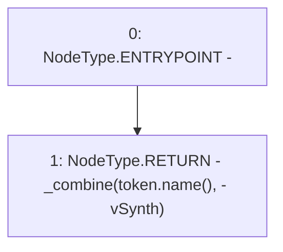

# Context: Synth._calculateName

**Contract:** `Synth` (Inherits: Ownable, ERC20, IERC20Metadata, ProtocolConstants, ISynth, IERC20, Context)
**Signature:** `_calculateName(IERC20Extended) returns (string)`
**Method Selector ID:** `Internal (No Method ID)`
**Visibility:** `internal`
**Environment-Free:** `Yes`
**Modifiers:** None

### State Variables Interaction
- **Reads:** None
- **Writes:** None

### Environment & Verification Flags
- **Uses Foundry Cheatcodes:** No
- **Has Echidna Properties:** No

### Internal Calls Tree
- None

### External Calls / Value Transfers
- `IERC20Extended.TMP_164(string) = HIGH_LEVEL_CALL, dest:token(IERC20Extended), function:name, arguments:[]  `

### Control Flow Graph (CFG)


### Source Mapping
Declared in: `certora-ac-datasets/detasets/web3bugs/dataset/web3bugs/52/contracts/dex-v2/synths/Synth.sol` on lines **22** to **28**

```solidity
    function _calculateName(IERC20Extended token)
        internal
        view
        returns (string memory)
    {
        return _combine(token.name(), " - vSynth");
    }

```
