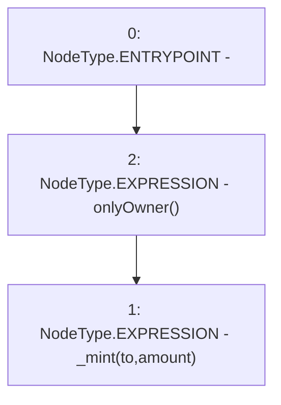

# Context: Synth.mint

**Contract:** `Synth` (Inherits: Ownable, ERC20, IERC20Metadata, ProtocolConstants, ISynth, IERC20, Context)
**Signature:** `mint(address,uint256)`
**Method Selector ID:** `0x40c10f19`
**Visibility:** `external`
**Environment-Free:** `No (reads EVM state context)`
**Modifiers:**
- `onlyOwner`
  ```solidity
  modifier onlyOwner() {
          _checkOwner();
          _;
      }
  ```

### State Variables Interaction
- **Reads:** None
- **Writes:** None

### Environment & Verification Flags
- **Uses Foundry Cheatcodes:** No
- **Has Echidna Properties:** No

### Internal Calls Tree
- None

### External Calls / Value Transfers
- None

### Control Flow Graph (CFG)


### Source Mapping
Declared in: `certora-ac-datasets/detasets/web3bugs/dataset/web3bugs/52/contracts/dex-v2/synths/Synth.sol` on lines **48** to **50**

```solidity
    function mint(address to, uint256 amount) external override onlyOwner {
        _mint(to, amount);
    }

```
