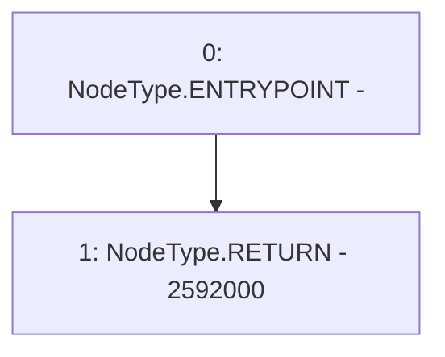

# Context: Timelock.MAXIMUM_DELAY

**Contract:** `Timelock` (Inherits: ITimelock)
**Signature:** `MAXIMUM_DELAY() returns (uint256)`
**Method Selector ID:** `0x7d645fab`
**Visibility:** `public`
**Environment-Free:** `Yes`
**Modifiers:** None

### State Variables Interaction
- **Reads:** None
- **Writes:** None

### Environment & Verification Flags
- **Uses Foundry Cheatcodes:** No
- **Has Echidna Properties:** No

### Internal Calls Tree
- None

### External Calls / Value Transfers
- None

### Control Flow Graph (CFG)


### Source Mapping
Declared in: `certora-ac-datasets/detasets/web3bugs/dataset/web3bugs/52/contracts/governance/Timelock.sol` on lines **121** to **123**

```solidity
    function MAXIMUM_DELAY() public pure virtual returns (uint256) {
        return 30 days;
    }

```
