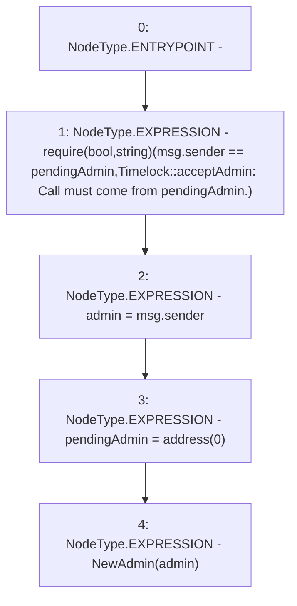

# Context: Timelock.acceptAdmin

**Contract:** `Timelock` (Inherits: ITimelock)
**Signature:** `acceptAdmin()`
**Method Selector ID:** `0x0e18b681`
**Visibility:** `public`
**Environment-Free:** `No (reads EVM state context)`
**Modifiers:** None

### State Variables Interaction
- **Reads:** admin, pendingAdmin
- **Writes:** admin, pendingAdmin

### Assertion Checks & Business Requirements
- require/assert: `require(bool,string)(msg.sender == pendingAdmin,Timelock::acceptAdmin: Call must come from pendingAdmin.)`

### Environment & Verification Flags
- **Uses Foundry Cheatcodes:** No
- **Has Echidna Properties:** No

### Internal Calls Tree
- None

### External Calls / Value Transfers
- None

### Control Flow Graph (CFG)


### Source Mapping
Declared in: `certora-ac-datasets/detasets/web3bugs/dataset/web3bugs/52/contracts/governance/Timelock.sol` on lines **161** to **170**

```solidity
    function acceptAdmin() public override {
        require(
            msg.sender == pendingAdmin,
            "Timelock::acceptAdmin: Call must come from pendingAdmin."
        );
        admin = msg.sender;
        pendingAdmin = address(0);

        emit NewAdmin(admin);
    }

```
