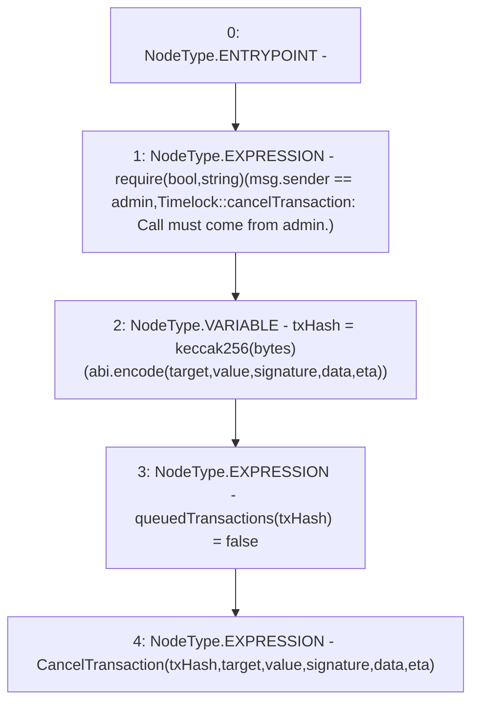

# Context: Timelock.cancelTransaction

**Contract:** `Timelock` (Inherits: ITimelock)
**Signature:** `cancelTransaction(address,uint256,string,bytes,uint256)`
**Method Selector ID:** `0x591fcdfe`
**Visibility:** `public`
**Environment-Free:** `No (reads EVM state context)`
**Modifiers:** None

### State Variables Interaction
- **Reads:** admin
- **Writes:** queuedTransactions

### Assertion Checks & Business Requirements
- require/assert: `require(bool,string)(msg.sender == admin,Timelock::cancelTransaction: Call must come from admin.)`

### Environment & Verification Flags
- **Uses Foundry Cheatcodes:** No
- **Has Echidna Properties:** No

### Internal Calls Tree
- None

### External Calls / Value Transfers
- None

### Control Flow Graph (CFG)


### Source Mapping
Declared in: `certora-ac-datasets/detasets/web3bugs/dataset/web3bugs/52/contracts/governance/Timelock.sol` on lines **224** to **242**

```solidity
    function cancelTransaction(
        address target,
        uint256 value,
        string memory signature,
        bytes memory data,
        uint256 eta
    ) public override {
        require(
            msg.sender == admin,
            "Timelock::cancelTransaction: Call must come from admin."
        );

        bytes32 txHash = keccak256(
            abi.encode(target, value, signature, data, eta)
        );
        queuedTransactions[txHash] = false;

        emit CancelTransaction(txHash, target, value, signature, data, eta);
    }

```
