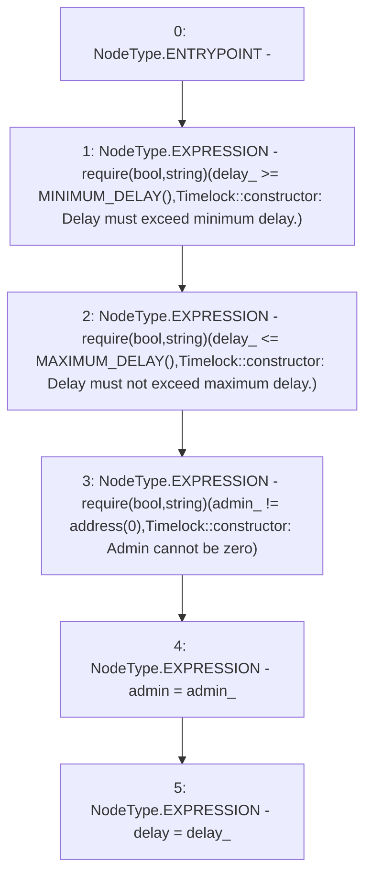

# Context: Timelock.constructor

**Contract:** `Timelock` (Inherits: ITimelock)
**Signature:** `constructor(address,uint256)`
**Method Selector ID:** `0x2a8c7b93`
**Visibility:** `public`
**Environment-Free:** `Yes`
**Modifiers:** None

### State Variables Interaction
- **Reads:** None
- **Writes:** admin, delay

### Assertion Checks & Business Requirements
- require/assert: `require(bool,string)(delay_ >= MINIMUM_DELAY(),Timelock::constructor: Delay must exceed minimum delay.)`
- require/assert: `require(bool,string)(delay_ <= MAXIMUM_DELAY(),Timelock::constructor: Delay must not exceed maximum delay.)`
- require/assert: `require(bool,string)(admin_ != address(0),Timelock::constructor: Admin cannot be zero)`

### Environment & Verification Flags
- **Uses Foundry Cheatcodes:** No
- **Has Echidna Properties:** No

### Internal Calls Tree
- None

### External Calls / Value Transfers
- None

### Control Flow Graph (CFG)


### Source Mapping
Declared in: `certora-ac-datasets/detasets/web3bugs/dataset/web3bugs/52/contracts/governance/Timelock.sol` on lines **84** to **101**

```solidity
    constructor(address admin_, uint256 delay_) {
        require(
            delay_ >= MINIMUM_DELAY(),
            "Timelock::constructor: Delay must exceed minimum delay."
        );
        require(
            delay_ <= MAXIMUM_DELAY(),
            "Timelock::constructor: Delay must not exceed maximum delay."
        );

        require(
            admin_ != address(0),
            "Timelock::constructor: Admin cannot be zero"
        );

        admin = admin_;
        delay = delay_;
    }

```
