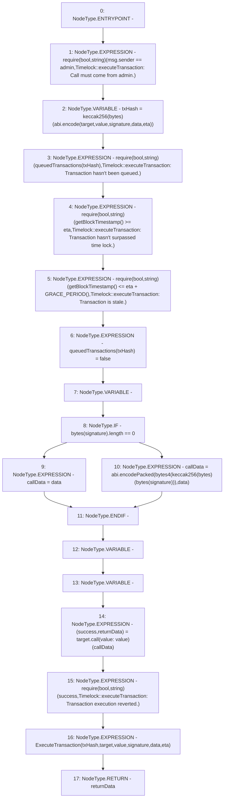

# Context: Timelock.executeTransaction

**Contract:** `Timelock` (Inherits: ITimelock)
**Signature:** `executeTransaction(address,uint256,string,bytes,uint256) returns (bytes)`
**Method Selector ID:** `0x0825f38f`
**Visibility:** `public`
**Environment-Free:** `No (reads EVM state context)`
**Modifiers:** None

### State Variables Interaction
- **Reads:** admin, queuedTransactions
- **Writes:** queuedTransactions

### Assertion Checks & Business Requirements
- require/assert: `require(bool,string)(msg.sender == admin,Timelock::executeTransaction: Call must come from admin.)`
- require/assert: `require(bool,string)(queuedTransactions[txHash],Timelock::executeTransaction: Transaction hasn't been queued.)`
- require/assert: `require(bool,string)(getBlockTimestamp() >= eta,Timelock::executeTransaction: Transaction hasn't surpassed time lock.)`
- require/assert: `require(bool,string)(getBlockTimestamp() <= eta + GRACE_PERIOD(),Timelock::executeTransaction: Transaction is stale.)`
- require/assert: `require(bool,string)(success,Timelock::executeTransaction: Transaction execution reverted.)`

### Environment & Verification Flags
- **Uses Foundry Cheatcodes:** No
- **Has Echidna Properties:** No

### Internal Calls Tree
- None

### External Calls / Value Transfers
- `low-level-call`

### Control Flow Graph (CFG)


### Source Mapping
Declared in: `certora-ac-datasets/detasets/web3bugs/dataset/web3bugs/52/contracts/governance/Timelock.sol` on lines **255** to **309**

```solidity
    function executeTransaction(
        address target,
        uint256 value,
        string memory signature,
        bytes memory data,
        uint256 eta
    ) public payable override returns (bytes memory) {
        require(
            msg.sender == admin,
            "Timelock::executeTransaction: Call must come from admin."
        );

        bytes32 txHash = keccak256(
            abi.encode(target, value, signature, data, eta)
        );
        require(
            queuedTransactions[txHash],
            "Timelock::executeTransaction: Transaction hasn't been queued."
        );
        require(
            getBlockTimestamp() >= eta,
            "Timelock::executeTransaction: Transaction hasn't surpassed time lock."
        );
        require(
            getBlockTimestamp() <= eta + GRACE_PERIOD(),
            "Timelock::executeTransaction: Transaction is stale."
        );

        queuedTransactions[txHash] = false;

        bytes memory callData;

        if (bytes(signature).length == 0) {
            callData = data;
        } else {
            callData = abi.encodePacked(
                bytes4(keccak256(bytes(signature))),
                data
            );
        }

        // solium-disable-next-line security/no-call-value
        (bool success, bytes memory returnData) = target.call{value: value}(
            callData
        );

        require(
            success,
            "Timelock::executeTransaction: Transaction execution reverted."
        );

        emit ExecuteTransaction(txHash, target, value, signature, data, eta);

        return returnData;
    }

```
