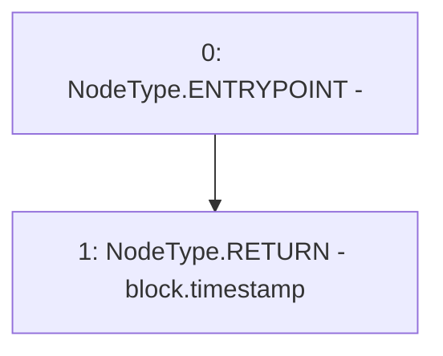

# Context: Timelock.getBlockTimestamp

**Contract:** `Timelock` (Inherits: ITimelock)
**Signature:** `getBlockTimestamp() returns (uint256)`
**Method Selector ID:** `Internal (No Method ID)`
**Visibility:** `internal`
**Environment-Free:** `No (reads EVM state context)`
**Modifiers:** None

### State Variables Interaction
- **Reads:** None
- **Writes:** None

### Environment & Verification Flags
- **Uses Foundry Cheatcodes:** No
- **Has Echidna Properties:** No

### Internal Calls Tree
- None

### External Calls / Value Transfers
- None

### Control Flow Graph (CFG)


### Source Mapping
Declared in: `certora-ac-datasets/detasets/web3bugs/dataset/web3bugs/52/contracts/governance/Timelock.sol` on lines **316** to **319**

```solidity
    function getBlockTimestamp() internal view returns (uint256) {
        // solium-disable-next-line security/no-block-members
        return block.timestamp;
    }

```
