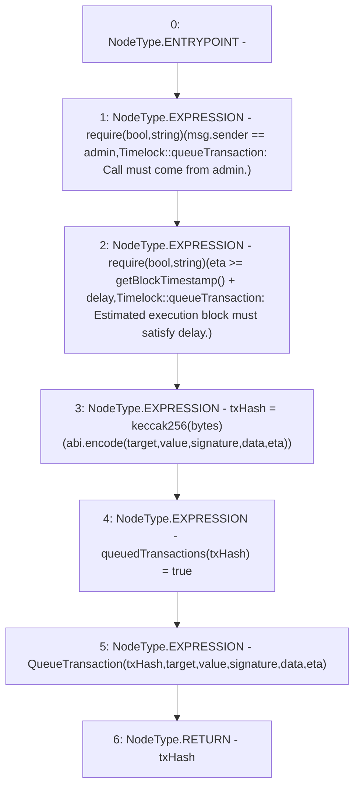

# Context: Timelock.queueTransaction

**Contract:** `Timelock` (Inherits: ITimelock)
**Signature:** `queueTransaction(address,uint256,string,bytes,uint256) returns (bytes32)`
**Method Selector ID:** `0x3a66f901`
**Visibility:** `public`
**Environment-Free:** `No (reads EVM state context)`
**Modifiers:** None

### State Variables Interaction
- **Reads:** admin, delay
- **Writes:** queuedTransactions

### Assertion Checks & Business Requirements
- require/assert: `require(bool,string)(msg.sender == admin,Timelock::queueTransaction: Call must come from admin.)`
- require/assert: `require(bool,string)(eta >= getBlockTimestamp() + delay,Timelock::queueTransaction: Estimated execution block must satisfy delay.)`

### Environment & Verification Flags
- **Uses Foundry Cheatcodes:** No
- **Has Echidna Properties:** No

### Internal Calls Tree
- None

### External Calls / Value Transfers
- None

### Control Flow Graph (CFG)


### Source Mapping
Declared in: `certora-ac-datasets/detasets/web3bugs/dataset/web3bugs/52/contracts/governance/Timelock.sol` on lines **196** to **216**

```solidity
    function queueTransaction(
        address target,
        uint256 value,
        string memory signature,
        bytes memory data,
        uint256 eta
    ) public override returns (bytes32 txHash) {
        require(
            msg.sender == admin,
            "Timelock::queueTransaction: Call must come from admin."
        );
        require(
            eta >= getBlockTimestamp() + delay,
            "Timelock::queueTransaction: Estimated execution block must satisfy delay."
        );

        txHash = keccak256(abi.encode(target, value, signature, data, eta));
        queuedTransactions[txHash] = true;

        emit QueueTransaction(txHash, target, value, signature, data, eta);
    }

```
