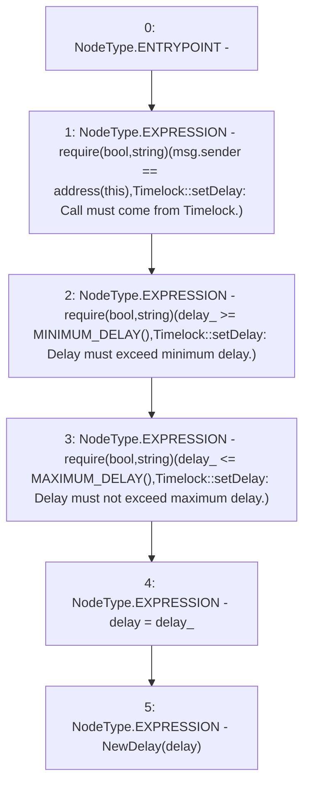

# Context: Timelock.setDelay

**Contract:** `Timelock` (Inherits: ITimelock)
**Signature:** `setDelay(uint256)`
**Method Selector ID:** `0xe177246e`
**Visibility:** `public`
**Environment-Free:** `No (reads EVM state context)`
**Modifiers:** None

### State Variables Interaction
- **Reads:** delay
- **Writes:** delay

### Assertion Checks & Business Requirements
- require/assert: `require(bool,string)(msg.sender == address(this),Timelock::setDelay: Call must come from Timelock.)`
- require/assert: `require(bool,string)(delay_ >= MINIMUM_DELAY(),Timelock::setDelay: Delay must exceed minimum delay.)`
- require/assert: `require(bool,string)(delay_ <= MAXIMUM_DELAY(),Timelock::setDelay: Delay must not exceed maximum delay.)`

### Environment & Verification Flags
- **Uses Foundry Cheatcodes:** No
- **Has Echidna Properties:** No

### Internal Calls Tree
- None

### External Calls / Value Transfers
- None

### Control Flow Graph (CFG)


### Source Mapping
Declared in: `certora-ac-datasets/detasets/web3bugs/dataset/web3bugs/52/contracts/governance/Timelock.sol` on lines **135** to **151**

```solidity
    function setDelay(uint256 delay_) public {
        require(
            msg.sender == address(this),
            "Timelock::setDelay: Call must come from Timelock."
        );
        require(
            delay_ >= MINIMUM_DELAY(),
            "Timelock::setDelay: Delay must exceed minimum delay."
        );
        require(
            delay_ <= MAXIMUM_DELAY(),
            "Timelock::setDelay: Delay must not exceed maximum delay."
        );
        delay = delay_;

        emit NewDelay(delay);
    }

```
