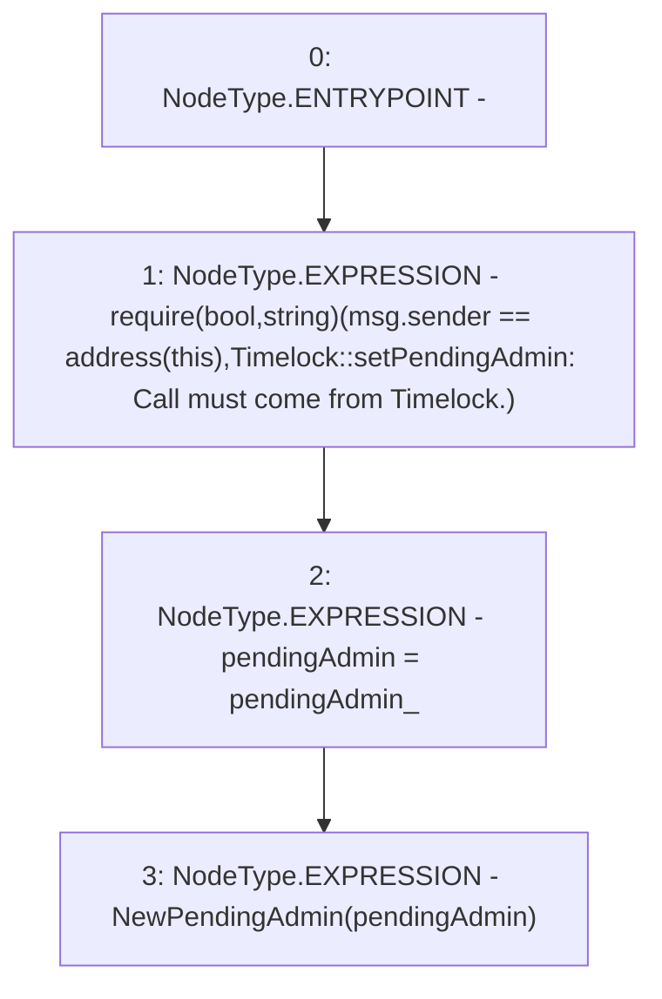

# Context: Timelock.setPendingAdmin

**Contract:** `Timelock` (Inherits: ITimelock)
**Signature:** `setPendingAdmin(address)`
**Method Selector ID:** `0x4dd18bf5`
**Visibility:** `public`
**Environment-Free:** `No (reads EVM state context)`
**Modifiers:** None

### State Variables Interaction
- **Reads:** pendingAdmin
- **Writes:** pendingAdmin

### Assertion Checks & Business Requirements
- require/assert: `require(bool,string)(msg.sender == address(this),Timelock::setPendingAdmin: Call must come from Timelock.)`

### Environment & Verification Flags
- **Uses Foundry Cheatcodes:** No
- **Has Echidna Properties:** No

### Internal Calls Tree
- None

### External Calls / Value Transfers
- None

### Control Flow Graph (CFG)


### Source Mapping
Declared in: `certora-ac-datasets/detasets/web3bugs/dataset/web3bugs/52/contracts/governance/Timelock.sol` on lines **179** to **187**

```solidity
    function setPendingAdmin(address pendingAdmin_) public {
        require(
            msg.sender == address(this),
            "Timelock::setPendingAdmin: Call must come from Timelock."
        );
        pendingAdmin = pendingAdmin_;

        emit NewPendingAdmin(pendingAdmin);
    }

```
