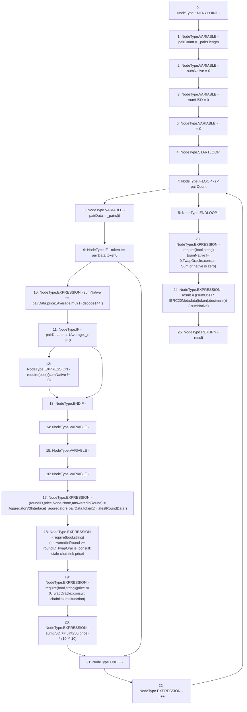

# Context: TwapOracle.consult

**Contract:** `TwapOracle` (Inherits: Ownable, Context)
**Signature:** `consult(address) returns (uint256)`
**Method Selector ID:** `0x283583c6`
**Visibility:** `public`
**Environment-Free:** `Yes`
**Modifiers:** None

### State Variables Interaction
- **Reads:** _aggregators, _pairs
- **Writes:** None

### Assertion Checks & Business Requirements
- require/assert: `require(bool)(sumNative != 0)`
- require/assert: `require(bool,string)(answeredInRound >= roundID,TwapOracle::consult: stale chainlink price)`
- require/assert: `require(bool,string)(price != 0,TwapOracle::consult: chainlink malfunction)`
- require/assert: `require(bool,string)(sumNative != 0,TwapOracle::consult: Sum of native is zero)`

### Environment & Verification Flags
- **Uses Foundry Cheatcodes:** No
- **Has Echidna Properties:** No

### Internal Calls Tree
- None

### External Calls / Value Transfers
- `IERC20Metadata.TMP_415(uint8) = HIGH_LEVEL_CALL, dest:TMP_414(IERC20Metadata), function:decimals, arguments:[]  `
- `FixedPoint.TMP_399(uint144) = LIBRARY_CALL, dest:FixedPoint, function:FixedPoint.decode144(FixedPoint.uq144x112), arguments:['TMP_398'] `
- `AggregatorV3Interface.TUPLE_7(uint80,int256,uint256,uint256,uint80) = HIGH_LEVEL_CALL, dest:TMP_403(AggregatorV3Interface), function:latestRoundData, arguments:[]  `
- `FixedPoint.TMP_398(FixedPoint.uq144x112) = LIBRARY_CALL, dest:FixedPoint, function:FixedPoint.mul(FixedPoint.uq112x112,uint256), arguments:['REF_79', '1'] `

### Control Flow Graph (CFG)


### Source Mapping
Declared in: `certora-ac-datasets/detasets/web3bugs/dataset/web3bugs/52/contracts/twap/TwapOracle.sol` on lines **115** to **157**

```solidity
    function consult(address token) public view returns (uint256 result) {
        uint256 pairCount = _pairs.length;
        uint256 sumNative = 0;
        uint256 sumUSD = 0;

        for (uint256 i = 0; i < pairCount; i++) {
            PairData memory pairData = _pairs[i];

            if (token == pairData.token0) {
                //
                // TODO - Review:
                //   Verify price1Average is amount of USDV against 1 unit of token1
                //

                sumNative += pairData.price1Average.mul(1).decode144(); // native asset amount
                if (pairData.price1Average._x != 0) {
                    require(sumNative != 0);
                }

                (
                    uint80 roundID,
                    int256 price,
                    ,
                    ,
                    uint80 answeredInRound
                ) = AggregatorV3Interface(_aggregators[pairData.token1])
                        .latestRoundData();

                require(
                    answeredInRound >= roundID,
                    "TwapOracle::consult: stale chainlink price"
                );
                require(
                    price != 0,
                    "TwapOracle::consult: chainlink malfunction"
                );

                sumUSD += uint256(price) * (10**10);
            }
        }
        require(sumNative != 0, "TwapOracle::consult: Sum of native is zero");
        result = ((sumUSD * IERC20Metadata(token).decimals()) / sumNative);
    }

```
