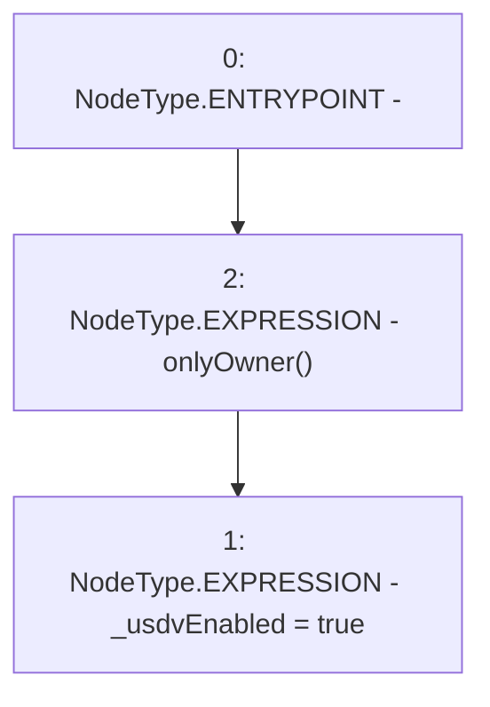

# Context: TwapOracle.enableUSDV

**Contract:** `TwapOracle` (Inherits: Ownable, Context)
**Signature:** `enableUSDV()`
**Method Selector ID:** `0xc2ace4f2`
**Visibility:** `external`
**Environment-Free:** `No (reads EVM state context)`
**Modifiers:**
- `onlyOwner`
  ```solidity
  modifier onlyOwner() {
          _checkOwner();
          _;
      }
  ```

### State Variables Interaction
- **Reads:** None
- **Writes:** _usdvEnabled

### Environment & Verification Flags
- **Uses Foundry Cheatcodes:** No
- **Has Echidna Properties:** No

### Internal Calls Tree
- None

### External Calls / Value Transfers
- None

### Control Flow Graph (CFG)


### Source Mapping
Declared in: `certora-ac-datasets/detasets/web3bugs/dataset/web3bugs/52/contracts/twap/TwapOracle.sol` on lines **220** to **222**

```solidity
    function enableUSDV() external onlyOwner {
        _usdvEnabled = true;
    }

```
