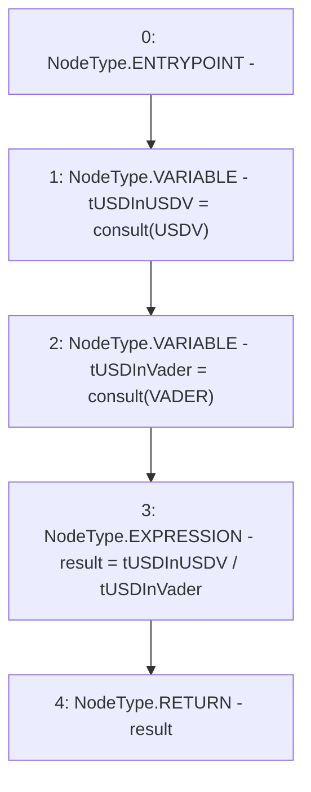

# Context: TwapOracle.getRate

**Contract:** `TwapOracle` (Inherits: Ownable, Context)
**Signature:** `getRate() returns (uint256)`
**Method Selector ID:** `0x679aefce`
**Visibility:** `public`
**Environment-Free:** `Yes`
**Modifiers:** None

### State Variables Interaction
- **Reads:** USDV, VADER
- **Writes:** None

### Environment & Verification Flags
- **Uses Foundry Cheatcodes:** No
- **Has Echidna Properties:** No

### Internal Calls Tree
- None

### External Calls / Value Transfers
- None

### Control Flow Graph (CFG)


### Source Mapping
Declared in: `certora-ac-datasets/detasets/web3bugs/dataset/web3bugs/52/contracts/twap/TwapOracle.sol` on lines **162** to **167**

```solidity
    function getRate() public view returns (uint256 result) {
        uint256 tUSDInUSDV = consult(USDV);
        uint256 tUSDInVader = consult(VADER);

        result = tUSDInUSDV / tUSDInVader;
    }

```
