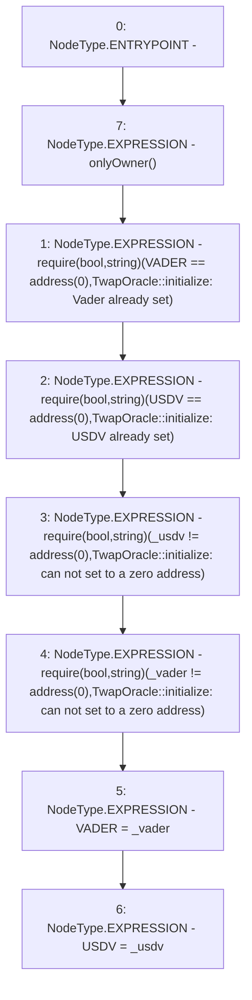

# Context: TwapOracle.initialize

**Contract:** `TwapOracle` (Inherits: Ownable, Context)
**Signature:** `initialize(address,address)`
**Method Selector ID:** `0x485cc955`
**Visibility:** `external`
**Environment-Free:** `No (reads EVM state context)`
**Modifiers:**
- `onlyOwner`
  ```solidity
  modifier onlyOwner() {
          _checkOwner();
          _;
      }
  ```

### State Variables Interaction
- **Reads:** USDV, VADER
- **Writes:** USDV, VADER

### Assertion Checks & Business Requirements
- require/assert: `require(bool,string)(VADER == address(0),TwapOracle::initialize: Vader already set)`
- require/assert: `require(bool,string)(USDV == address(0),TwapOracle::initialize: USDV already set)`
- require/assert: `require(bool,string)(_usdv != address(0),TwapOracle::initialize: can not set to a zero address)`
- require/assert: `require(bool,string)(_vader != address(0),TwapOracle::initialize: can not set to a zero address)`

### Environment & Verification Flags
- **Uses Foundry Cheatcodes:** No
- **Has Echidna Properties:** No

### Internal Calls Tree
- None

### External Calls / Value Transfers
- None

### Control Flow Graph (CFG)


### Source Mapping
Declared in: `certora-ac-datasets/detasets/web3bugs/dataset/web3bugs/52/contracts/twap/TwapOracle.sol` on lines **198** to **215**

```solidity
    function initialize(address _usdv, address _vader) external onlyOwner {
        require(
            VADER == address(0),
            "TwapOracle::initialize: Vader already set"
        );
        require(USDV == address(0), "TwapOracle::initialize: USDV already set");
        require(
            _usdv != address(0),
            "TwapOracle::initialize: can not set to a zero address"
        );
        require(
            _vader != address(0),
            "TwapOracle::initialize: can not set to a zero address"
        );

        VADER = _vader;
        USDV = _usdv;
    }

```
