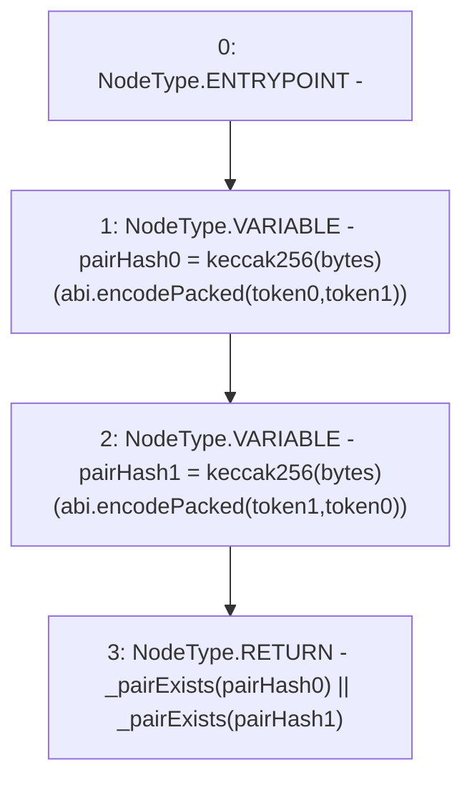

# Context: TwapOracle.pairExists

**Contract:** `TwapOracle` (Inherits: Ownable, Context)
**Signature:** `pairExists(address,address) returns (bool)`
**Method Selector ID:** `0x66a7bc4b`
**Visibility:** `public`
**Environment-Free:** `Yes`
**Modifiers:** None

### State Variables Interaction
- **Reads:** _pairExists
- **Writes:** None

### Environment & Verification Flags
- **Uses Foundry Cheatcodes:** No
- **Has Echidna Properties:** No

### Internal Calls Tree
- None

### External Calls / Value Transfers
- None

### Control Flow Graph (CFG)


### Source Mapping
Declared in: `certora-ac-datasets/detasets/web3bugs/dataset/web3bugs/52/contracts/twap/TwapOracle.sol` on lines **100** to **108**

```solidity
    function pairExists(address token0, address token1)
        public
        view
        returns (bool)
    {
        bytes32 pairHash0 = keccak256(abi.encodePacked(token0, token1));
        bytes32 pairHash1 = keccak256(abi.encodePacked(token1, token0));
        return _pairExists[pairHash0] || _pairExists[pairHash1];
    }

```
