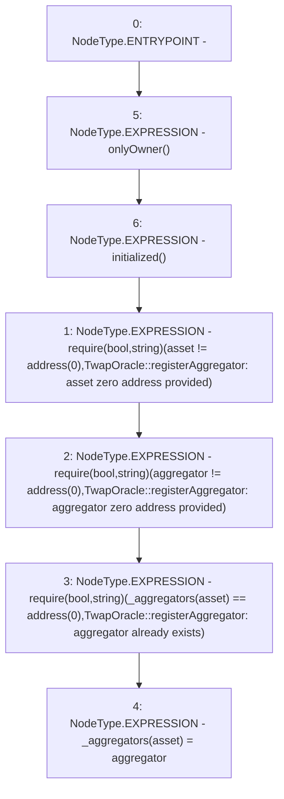

# Context: TwapOracle.registerAggregator

**Contract:** `TwapOracle` (Inherits: Ownable, Context)
**Signature:** `registerAggregator(address,address)`
**Method Selector ID:** `0x837e7885`
**Visibility:** `external`
**Environment-Free:** `No (reads EVM state context)`
**Modifiers:**
- `onlyOwner`
  ```solidity
  modifier onlyOwner() {
          _checkOwner();
          _;
      }
  ```
- `initialized`
  ```solidity
  modifier initialized() {
          require(
              VADER != address(0) && USDV != address(0),
              "TwapOracle::initialized: not initialized"
          );
          _;
      }
  ```

### State Variables Interaction
- **Reads:** _aggregators
- **Writes:** _aggregators

### Assertion Checks & Business Requirements
- require/assert: `require(bool,string)(asset != address(0),TwapOracle::registerAggregator: asset zero address provided)`
- require/assert: `require(bool,string)(aggregator != address(0),TwapOracle::registerAggregator: aggregator zero address provided)`
- require/assert: `require(bool,string)(_aggregators[asset] == address(0),TwapOracle::registerAggregator: aggregator already exists)`

### Environment & Verification Flags
- **Uses Foundry Cheatcodes:** No
- **Has Echidna Properties:** No

### Internal Calls Tree
- None

### External Calls / Value Transfers
- None

### Control Flow Graph (CFG)


### Source Mapping
Declared in: `certora-ac-datasets/detasets/web3bugs/dataset/web3bugs/52/contracts/twap/TwapOracle.sol` on lines **229** to **248**

```solidity
    function registerAggregator(address asset, address aggregator)
        external
        onlyOwner
        initialized
    {
        require(
            asset != address(0),
            "TwapOracle::registerAggregator: asset zero address provided"
        );
        require(
            aggregator != address(0),
            "TwapOracle::registerAggregator: aggregator zero address provided"
        );
        require(
            _aggregators[asset] == address(0),
            "TwapOracle::registerAggregator: aggregator already exists"
        );

        _aggregators[asset] = aggregator;
    }

```
