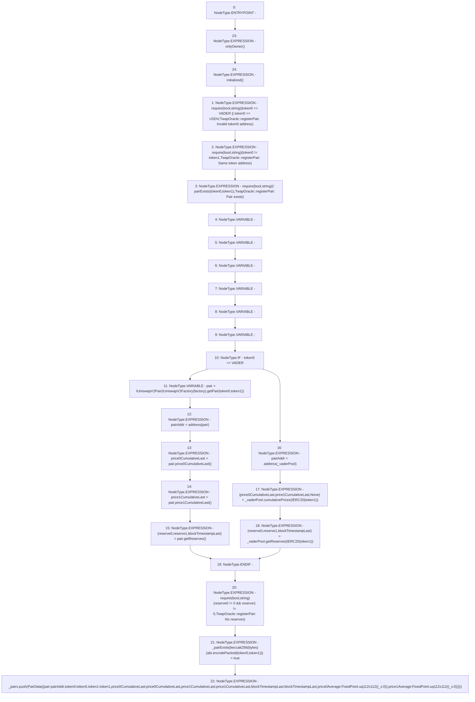

# Context: TwapOracle.registerPair

**Contract:** `TwapOracle` (Inherits: Ownable, Context)
**Signature:** `registerPair(address,address,address)`
**Method Selector ID:** `0xbfbd0297`
**Visibility:** `external`
**Environment-Free:** `No (reads EVM state context)`
**Modifiers:**
- `onlyOwner`
  ```solidity
  modifier onlyOwner() {
          _checkOwner();
          _;
      }
  ```
- `initialized`
  ```solidity
  modifier initialized() {
          require(
              VADER != address(0) && USDV != address(0),
              "TwapOracle::initialized: not initialized"
          );
          _;
      }
  ```

### State Variables Interaction
- **Reads:** USDV, VADER, _pairs, _vaderPool
- **Writes:** _pairExists, _pairs

### Assertion Checks & Business Requirements
- require/assert: `require(bool,string)(token0 == VADER || token0 == USDV,TwapOracle::registerPair: Invalid token0 address)`
- require/assert: `require(bool,string)(token0 != token1,TwapOracle::registerPair: Same token address)`
- require/assert: `require(bool,string)(! pairExists(token0,token1),TwapOracle::registerPair: Pair exists)`
- require/assert: `require(bool,string)(reserve0 != 0 && reserve1 != 0,TwapOracle::registerPair: No reserves)`

### Environment & Verification Flags
- **Uses Foundry Cheatcodes:** No
- **Has Echidna Properties:** No

### Internal Calls Tree
- None

### External Calls / Value Transfers
- `IUniswapV2Pair.TMP_468(uint256) = HIGH_LEVEL_CALL, dest:pair(IUniswapV2Pair), function:price1CumulativeLast, arguments:[]  `
- `IVaderPoolV2.TUPLE_10(uint112,uint112,uint32) = HIGH_LEVEL_CALL, dest:_vaderPool(IVaderPoolV2), function:getReserves, arguments:['TMP_471']  `
- `IVaderPoolV2.TUPLE_9(uint256,uint256,uint32) = HIGH_LEVEL_CALL, dest:_vaderPool(IVaderPoolV2), function:cumulativePrices, arguments:['TMP_470']  `
- `IUniswapV2Factory.TMP_464(address) = HIGH_LEVEL_CALL, dest:TMP_463(IUniswapV2Factory), function:getPair, arguments:['token0', 'token1']  `
- `IUniswapV2Pair.TUPLE_8(uint112,uint112,uint32) = HIGH_LEVEL_CALL, dest:pair(IUniswapV2Pair), function:getReserves, arguments:[]  `
- `IUniswapV2Pair.TMP_467(uint256) = HIGH_LEVEL_CALL, dest:pair(IUniswapV2Pair), function:price0CumulativeLast, arguments:[]  `

### Control Flow Graph (CFG)


### Source Mapping
Declared in: `certora-ac-datasets/detasets/web3bugs/dataset/web3bugs/52/contracts/twap/TwapOracle.sol` on lines **256** to **317**

```solidity
    function registerPair(
        address factory,
        address token0,
        address token1
    ) external onlyOwner initialized {
        require(
            token0 == VADER || token0 == USDV,
            "TwapOracle::registerPair: Invalid token0 address"
        );
        require(
            token0 != token1,
            "TwapOracle::registerPair: Same token address"
        );
        require(
            !pairExists(token0, token1),
            "TwapOracle::registerPair: Pair exists"
        );

        address pairAddr;
        uint256 price0CumulativeLast;
        uint256 price1CumulativeLast;
        uint112 reserve0;
        uint112 reserve1;
        uint32 blockTimestampLast;

        if (token0 == VADER) {
            IUniswapV2Pair pair = IUniswapV2Pair(
                IUniswapV2Factory(factory).getPair(token0, token1)
            );
            pairAddr = address(pair);
            price0CumulativeLast = pair.price0CumulativeLast();
            price1CumulativeLast = pair.price1CumulativeLast();
            (reserve0, reserve1, blockTimestampLast) = pair.getReserves();
        } else {
            pairAddr = address(_vaderPool);
            (price0CumulativeLast, price1CumulativeLast, ) = _vaderPool
                .cumulativePrices(IERC20(token1));
            (reserve0, reserve1, blockTimestampLast) = _vaderPool.getReserves(
                IERC20(token1)
            );
        }

        require(
            reserve0 != 0 && reserve1 != 0,
            "TwapOracle::registerPair: No reserves"
        );

        _pairExists[keccak256(abi.encodePacked(token0, token1))] = true;

        _pairs.push(
            PairData({
                pair: pairAddr,
                token0: token0,
                token1: token1,
                price0CumulativeLast: price0CumulativeLast,
                price1CumulativeLast: price1CumulativeLast,
                blockTimestampLast: blockTimestampLast,
                price0Average: FixedPoint.uq112x112({_x: 0}),
                price1Average: FixedPoint.uq112x112({_x: 0})
            })
        );
    }

```
