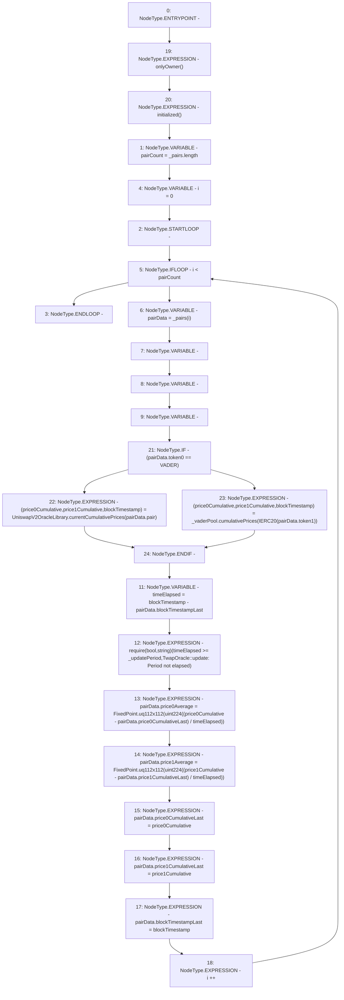

# Context: TwapOracle.update

**Contract:** `TwapOracle` (Inherits: Ownable, Context)
**Signature:** `update()`
**Method Selector ID:** `0xa2e62045`
**Visibility:** `external`
**Environment-Free:** `No (reads EVM state context)`
**Modifiers:**
- `onlyOwner`
  ```solidity
  modifier onlyOwner() {
          _checkOwner();
          _;
      }
  ```
- `initialized`
  ```solidity
  modifier initialized() {
          require(
              VADER != address(0) && USDV != address(0),
              "TwapOracle::initialized: not initialized"
          );
          _;
      }
  ```

### State Variables Interaction
- **Reads:** VADER, _pairs, _updatePeriod, _vaderPool
- **Writes:** _pairs

### Assertion Checks & Business Requirements
- require/assert: `require(bool,string)(timeElapsed >= _updatePeriod,TwapOracle::update: Period not elapsed)`

### Environment & Verification Flags
- **Uses Foundry Cheatcodes:** No
- **Has Echidna Properties:** No

### Internal Calls Tree
- None

### External Calls / Value Transfers
- `IVaderPoolV2.TUPLE_12(uint256,uint256,uint32) = HIGH_LEVEL_CALL, dest:_vaderPool(IVaderPoolV2), function:cumulativePrices, arguments:['TMP_502']  `
- `UniswapV2OracleLibrary.TUPLE_11(uint256,uint256,uint32) = LIBRARY_CALL, dest:UniswapV2OracleLibrary, function:UniswapV2OracleLibrary.currentCumulativePrices(address), arguments:['REF_117'] `

### Control Flow Graph (CFG)


### Source Mapping
Declared in: `certora-ac-datasets/detasets/web3bugs/dataset/web3bugs/52/contracts/twap/TwapOracle.sol` on lines **322** to **369**

```solidity
    function update() external onlyOwner initialized {
        uint256 pairCount = _pairs.length;

        // Update all of the registered pairs in the TWAP oracle.
        for (uint256 i = 0; i < pairCount; i++) {
            PairData storage pairData = _pairs[i];

            // Get the current cumulative prices and block timestamp of the current pairing.
            (
                uint256 price0Cumulative,
                uint256 price1Cumulative,
                uint32 blockTimestamp
            ) = (pairData.token0 == VADER)
                    ? UniswapV2OracleLibrary.currentCumulativePrices(
                        pairData.pair
                    )
                    : _vaderPool.cumulativePrices(IERC20(pairData.token1));

            unchecked {
                // Ensure that at least one full period has passed since the pairing was last update.
                uint32 timeElapsed = blockTimestamp -
                    pairData.blockTimestampLast;
                require(
                    timeElapsed >= _updatePeriod,
                    "TwapOracle::update: Period not elapsed"
                );

                // Cumulative price is in (uq112x112 price * seconds) units so we simply wrap it after division by time elapsed.
                pairData.price0Average = FixedPoint.uq112x112(
                    uint224(
                        (price0Cumulative - pairData.price0CumulativeLast) /
                            timeElapsed
                    )
                );
                pairData.price1Average = FixedPoint.uq112x112(
                    uint224(
                        (price1Cumulative - pairData.price1CumulativeLast) /
                            timeElapsed
                    )
                );
            }

            // Update the stored pairing data
            pairData.price0CumulativeLast = price0Cumulative;
            pairData.price1CumulativeLast = price1Cumulative;
            pairData.blockTimestampLast = blockTimestamp;
        }
    }

```
