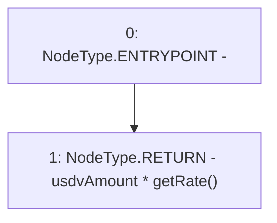

# Context: TwapOracle.usdvtoVader

**Contract:** `TwapOracle` (Inherits: Ownable, Context)
**Signature:** `usdvtoVader(uint256) returns (uint256)`
**Method Selector ID:** `0x78906a14`
**Visibility:** `external`
**Environment-Free:** `Yes`
**Modifiers:** None

### State Variables Interaction
- **Reads:** None
- **Writes:** None

### Environment & Verification Flags
- **Uses Foundry Cheatcodes:** No
- **Has Echidna Properties:** No

### Internal Calls Tree
- None

### External Calls / Value Transfers
- None

### Control Flow Graph (CFG)


### Source Mapping
Declared in: `certora-ac-datasets/detasets/web3bugs/dataset/web3bugs/52/contracts/twap/TwapOracle.sol` on lines **173** to **175**

```solidity
    function usdvtoVader(uint256 usdvAmount) external view returns (uint256) {
        return usdvAmount * getRate();
    }

```
