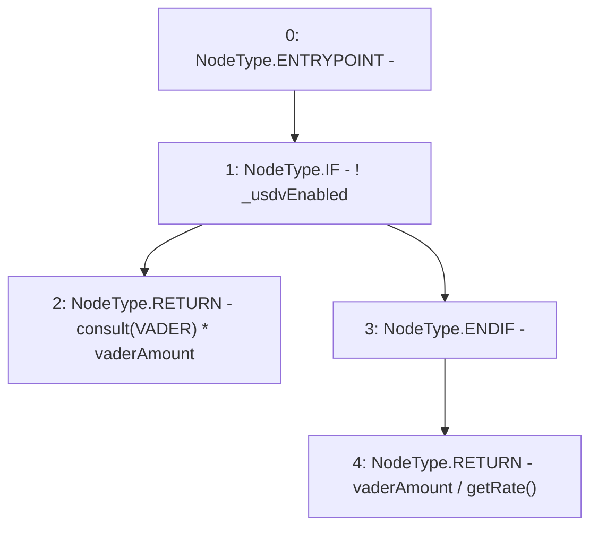

# Context: TwapOracle.vaderToUsdv

**Contract:** `TwapOracle` (Inherits: Ownable, Context)
**Signature:** `vaderToUsdv(uint256) returns (uint256)`
**Method Selector ID:** `0x97916dbe`
**Visibility:** `external`
**Environment-Free:** `Yes`
**Modifiers:** None

### State Variables Interaction
- **Reads:** VADER, _usdvEnabled
- **Writes:** None

### Environment & Verification Flags
- **Uses Foundry Cheatcodes:** No
- **Has Echidna Properties:** No

### Internal Calls Tree
- None

### External Calls / Value Transfers
- None

### Control Flow Graph (CFG)


### Source Mapping
Declared in: `certora-ac-datasets/detasets/web3bugs/dataset/web3bugs/52/contracts/twap/TwapOracle.sol` on lines **181** to **189**

```solidity
    function vaderToUsdv(uint256 vaderAmount) external view returns (uint256) {
        if (!_usdvEnabled) {
            // consult call returns true USD amount against 1 Vader and is multiplied with {vaderAmount}.
            return consult(VADER) * vaderAmount;
        }

        // usdv price is disabled so true USD value of both Vader and USDV is taken into account.
        return vaderAmount / getRate();
    }

```
