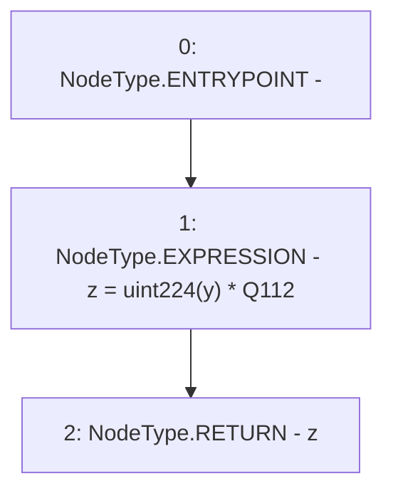

# Context: UQ112x112.encode

**Contract:** `UQ112x112` (Inherits: None)
**Signature:** `encode(uint112) returns (uint224)`
**Method Selector ID:** `Internal (No Method ID)`
**Visibility:** `internal`
**Environment-Free:** `Yes`
**Modifiers:** None

### State Variables Interaction
- **Reads:** Q112
- **Writes:** None

### Environment & Verification Flags
- **Uses Foundry Cheatcodes:** No
- **Has Echidna Properties:** No

### Internal Calls Tree
- None

### External Calls / Value Transfers
- None

### Control Flow Graph (CFG)


### Source Mapping
Declared in: `certora-ac-datasets/detasets/web3bugs/dataset/web3bugs/52/contracts/external/libraries/UQ112x112.sol` on lines **14** to **16**

```solidity
    function encode(uint112 y) internal pure returns (uint224 z) {
        z = uint224(y) * Q112; // never overflows
    }

```
