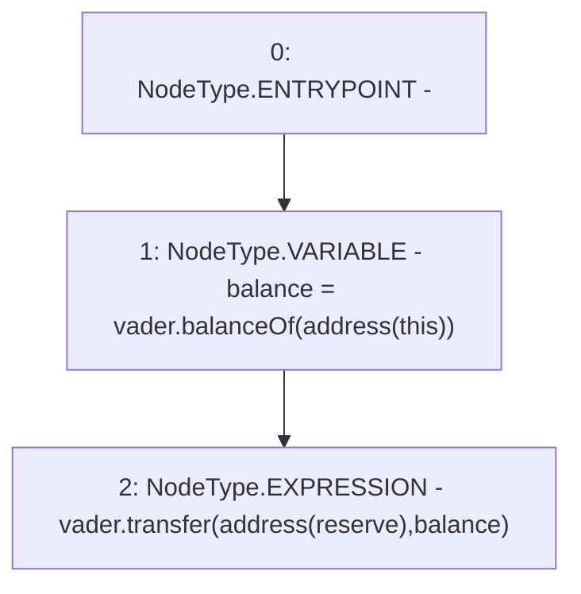

# Context: USDV.distributeEmission

**Contract:** `USDV` (Inherits: Ownable, ERC20, IERC20Metadata, IERC20, Context, ProtocolConstants, IUSDV)
**Signature:** `distributeEmission()`
**Method Selector ID:** `0x6bfa1dba`
**Visibility:** `external`
**Environment-Free:** `Yes`
**Modifiers:** None

### State Variables Interaction
- **Reads:** reserve, vader
- **Writes:** None

### Environment & Verification Flags
- **Uses Foundry Cheatcodes:** No
- **Has Echidna Properties:** No

### Internal Calls Tree
- None

### External Calls / Value Transfers
- `IERC20.TMP_174(bool) = HIGH_LEVEL_CALL, dest:vader(IERC20), function:transfer, arguments:['TMP_173', 'balance']  `
- `IERC20.TMP_172(uint256) = HIGH_LEVEL_CALL, dest:vader(IERC20), function:balanceOf, arguments:['TMP_171']  `

### Control Flow Graph (CFG)


### Source Mapping
Declared in: `certora-ac-datasets/detasets/web3bugs/dataset/web3bugs/52/contracts/tokens/USDV.sol` on lines **37** to **41**

```solidity
    function distributeEmission() external override {
        // TODO: Adjust when incentives clearly defined
        uint256 balance = vader.balanceOf(address(this));
        vader.transfer(address(reserve), balance);
    }

```
