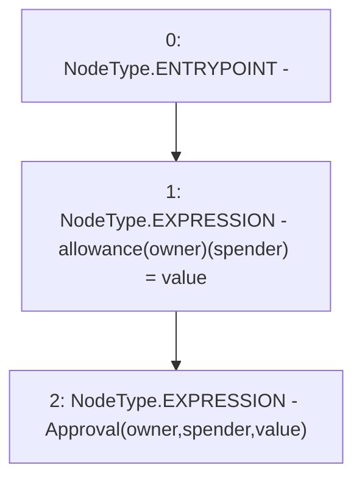

# Context: UniswapV2ERC20._approve

**Contract:** `UniswapV2ERC20` (Inherits: IUniswapV2ERC20)
**Signature:** `_approve(address,address,uint256)`
**Method Selector ID:** `Internal (No Method ID)`
**Visibility:** `private`
**Environment-Free:** `Yes`
**Modifiers:** None

### State Variables Interaction
- **Reads:** None
- **Writes:** allowance

### Environment & Verification Flags
- **Uses Foundry Cheatcodes:** No
- **Has Echidna Properties:** No

### Internal Calls Tree
- None

### External Calls / Value Transfers
- None

### Control Flow Graph (CFG)


### Source Mapping
Declared in: `certora-ac-datasets/detasets/web3bugs/dataset/web3bugs/52/contracts/external/UniswapV2ERC20.sol` on lines **51** to **58**

```solidity
    function _approve(
        address owner,
        address spender,
        uint256 value
    ) private {
        allowance[owner][spender] = value;
        emit Approval(owner, spender, value);
    }

```
