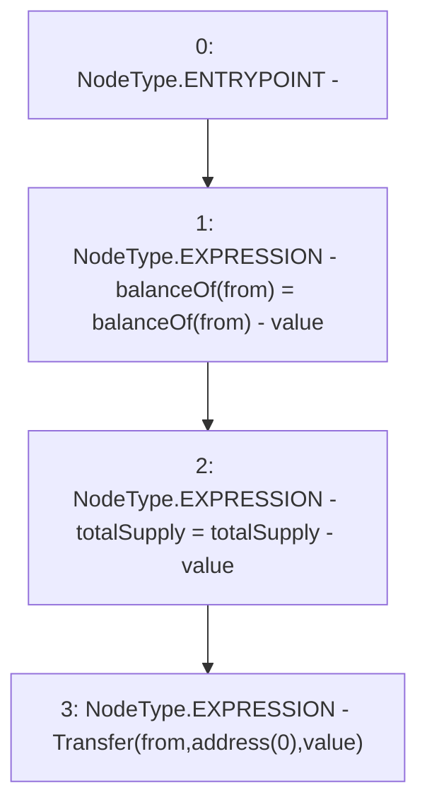

# Context: UniswapV2ERC20._burn

**Contract:** `UniswapV2ERC20` (Inherits: IUniswapV2ERC20)
**Signature:** `_burn(address,uint256)`
**Method Selector ID:** `Internal (No Method ID)`
**Visibility:** `internal`
**Environment-Free:** `Yes`
**Modifiers:** None

### State Variables Interaction
- **Reads:** balanceOf, totalSupply
- **Writes:** balanceOf, totalSupply

### Environment & Verification Flags
- **Uses Foundry Cheatcodes:** No
- **Has Echidna Properties:** No

### Internal Calls Tree
- None

### External Calls / Value Transfers
- None

### Control Flow Graph (CFG)


### Source Mapping
Declared in: `certora-ac-datasets/detasets/web3bugs/dataset/web3bugs/52/contracts/external/UniswapV2ERC20.sol` on lines **45** to **49**

```solidity
    function _burn(address from, uint256 value) internal {
        balanceOf[from] = balanceOf[from] - value;
        totalSupply = totalSupply - value;
        emit Transfer(from, address(0), value);
    }

```
