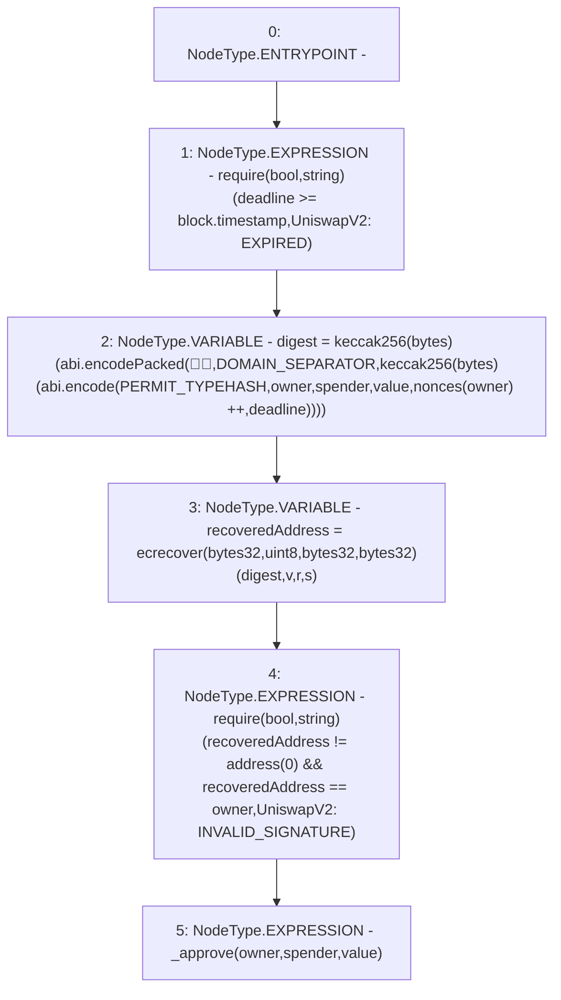

# Context: UniswapV2ERC20.permit

**Contract:** `UniswapV2ERC20` (Inherits: IUniswapV2ERC20)
**Signature:** `permit(address,address,uint256,uint256,uint8,bytes32,bytes32)`
**Method Selector ID:** `0xd505accf`
**Visibility:** `external`
**Environment-Free:** `No (reads EVM state context)`
**Modifiers:** None

### State Variables Interaction
- **Reads:** DOMAIN_SEPARATOR, PERMIT_TYPEHASH, nonces
- **Writes:** nonces

### Assertion Checks & Business Requirements
- require/assert: `require(bool,string)(deadline >= block.timestamp,UniswapV2: EXPIRED)`
- require/assert: `require(bool,string)(recoveredAddress != address(0) && recoveredAddress == owner,UniswapV2: INVALID_SIGNATURE)`

### Environment & Verification Flags
- **Uses Foundry Cheatcodes:** No
- **Has Echidna Properties:** No

### Internal Calls Tree
- None

### External Calls / Value Transfers
- None

### Control Flow Graph (CFG)


### Source Mapping
Declared in: `certora-ac-datasets/detasets/web3bugs/dataset/web3bugs/52/contracts/external/UniswapV2ERC20.sol` on lines **92** to **124**

```solidity
    function permit(
        address owner,
        address spender,
        uint256 value,
        uint256 deadline,
        uint8 v,
        bytes32 r,
        bytes32 s
    ) external {
        require(deadline >= block.timestamp, "UniswapV2: EXPIRED");
        bytes32 digest = keccak256(
            abi.encodePacked(
                "\x19\x01",
                DOMAIN_SEPARATOR,
                keccak256(
                    abi.encode(
                        PERMIT_TYPEHASH,
                        owner,
                        spender,
                        value,
                        nonces[owner]++,
                        deadline
                    )
                )
            )
        );
        address recoveredAddress = ecrecover(digest, v, r, s);
        require(
            recoveredAddress != address(0) && recoveredAddress == owner,
            "UniswapV2: INVALID_SIGNATURE"
        );
        _approve(owner, spender, value);
    }

```
