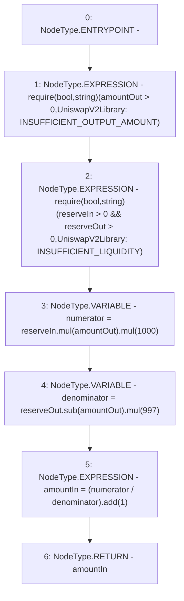

# Context: UniswapV2Library.getAmountIn

**Contract:** `UniswapV2Library` (Inherits: None)
**Signature:** `getAmountIn(uint256,uint256,uint256) returns (uint256)`
**Method Selector ID:** `Internal (No Method ID)`
**Visibility:** `internal`
**Environment-Free:** `Yes`
**Modifiers:** None

### State Variables Interaction
- **Reads:** None
- **Writes:** None

### Assertion Checks & Business Requirements
- require/assert: `require(bool,string)(amountOut > 0,UniswapV2Library: INSUFFICIENT_OUTPUT_AMOUNT)`
- require/assert: `require(bool,string)(reserveIn > 0 && reserveOut > 0,UniswapV2Library: INSUFFICIENT_LIQUIDITY)`

### Environment & Verification Flags
- **Uses Foundry Cheatcodes:** No
- **Has Echidna Properties:** No

### Internal Calls Tree
- None

### External Calls / Value Transfers
- `SafeMath.TMP_333(uint256) = LIBRARY_CALL, dest:SafeMath, function:SafeMath.mul(uint256,uint256), arguments:['TMP_332', '997'] `
- `SafeMath.TMP_331(uint256) = LIBRARY_CALL, dest:SafeMath, function:SafeMath.mul(uint256,uint256), arguments:['TMP_330', '1000'] `
- `SafeMath.TMP_330(uint256) = LIBRARY_CALL, dest:SafeMath, function:SafeMath.mul(uint256,uint256), arguments:['reserveIn', 'amountOut'] `
- `SafeMath.TMP_335(uint256) = LIBRARY_CALL, dest:SafeMath, function:SafeMath.add(uint256,uint256), arguments:['TMP_334', '1'] `
- `SafeMath.TMP_332(uint256) = LIBRARY_CALL, dest:SafeMath, function:SafeMath.sub(uint256,uint256), arguments:['reserveOut', 'amountOut'] `

### Control Flow Graph (CFG)


### Source Mapping
Declared in: `certora-ac-datasets/detasets/web3bugs/dataset/web3bugs/52/contracts/external/libraries/UniswapV2Library.sol` on lines **97** to **110**

```solidity
    function getAmountIn(
        uint256 amountOut,
        uint256 reserveIn,
        uint256 reserveOut
    ) internal pure returns (uint256 amountIn) {
        require(amountOut > 0, "UniswapV2Library: INSUFFICIENT_OUTPUT_AMOUNT");
        require(
            reserveIn > 0 && reserveOut > 0,
            "UniswapV2Library: INSUFFICIENT_LIQUIDITY"
        );
        uint256 numerator = reserveIn.mul(amountOut).mul(1000);
        uint256 denominator = reserveOut.sub(amountOut).mul(997);
        amountIn = (numerator / denominator).add(1);
    }

```
