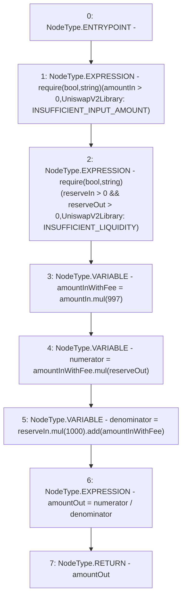

# Context: UniswapV2Library.getAmountOut

**Contract:** `UniswapV2Library` (Inherits: None)
**Signature:** `getAmountOut(uint256,uint256,uint256) returns (uint256)`
**Method Selector ID:** `Internal (No Method ID)`
**Visibility:** `internal`
**Environment-Free:** `Yes`
**Modifiers:** None

### State Variables Interaction
- **Reads:** None
- **Writes:** None

### Assertion Checks & Business Requirements
- require/assert: `require(bool,string)(amountIn > 0,UniswapV2Library: INSUFFICIENT_INPUT_AMOUNT)`
- require/assert: `require(bool,string)(reserveIn > 0 && reserveOut > 0,UniswapV2Library: INSUFFICIENT_LIQUIDITY)`

### Environment & Verification Flags
- **Uses Foundry Cheatcodes:** No
- **Has Echidna Properties:** No

### Internal Calls Tree
- None

### External Calls / Value Transfers
- `SafeMath.TMP_320(uint256) = LIBRARY_CALL, dest:SafeMath, function:SafeMath.mul(uint256,uint256), arguments:['amountInWithFee', 'reserveOut'] `
- `SafeMath.TMP_321(uint256) = LIBRARY_CALL, dest:SafeMath, function:SafeMath.mul(uint256,uint256), arguments:['reserveIn', '1000'] `
- `SafeMath.TMP_319(uint256) = LIBRARY_CALL, dest:SafeMath, function:SafeMath.mul(uint256,uint256), arguments:['amountIn', '997'] `
- `SafeMath.TMP_322(uint256) = LIBRARY_CALL, dest:SafeMath, function:SafeMath.add(uint256,uint256), arguments:['TMP_321', 'amountInWithFee'] `

### Control Flow Graph (CFG)


### Source Mapping
Declared in: `certora-ac-datasets/detasets/web3bugs/dataset/web3bugs/52/contracts/external/libraries/UniswapV2Library.sol` on lines **80** to **94**

```solidity
    function getAmountOut(
        uint256 amountIn,
        uint256 reserveIn,
        uint256 reserveOut
    ) internal pure returns (uint256 amountOut) {
        require(amountIn > 0, "UniswapV2Library: INSUFFICIENT_INPUT_AMOUNT");
        require(
            reserveIn > 0 && reserveOut > 0,
            "UniswapV2Library: INSUFFICIENT_LIQUIDITY"
        );
        uint256 amountInWithFee = amountIn.mul(997);
        uint256 numerator = amountInWithFee.mul(reserveOut);
        uint256 denominator = reserveIn.mul(1000).add(amountInWithFee);
        amountOut = numerator / denominator;
    }

```
