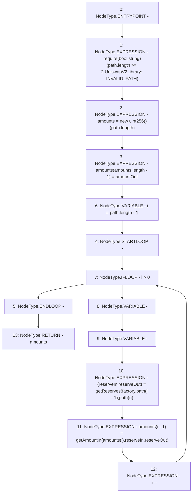

# Context: UniswapV2Library.getAmountsIn

**Contract:** `UniswapV2Library` (Inherits: None)
**Signature:** `getAmountsIn(address,uint256,address[]) returns (uint256[])`
**Method Selector ID:** `Internal (No Method ID)`
**Visibility:** `internal`
**Environment-Free:** `Yes`
**Modifiers:** None

### State Variables Interaction
- **Reads:** None
- **Writes:** None

### Assertion Checks & Business Requirements
- require/assert: `require(bool,string)(path.length >= 2,UniswapV2Library: INVALID_PATH)`

### Environment & Verification Flags
- **Uses Foundry Cheatcodes:** No
- **Has Echidna Properties:** No

### Internal Calls Tree
- None

### External Calls / Value Transfers
- None

### Control Flow Graph (CFG)


### Source Mapping
Declared in: `certora-ac-datasets/detasets/web3bugs/dataset/web3bugs/52/contracts/external/libraries/UniswapV2Library.sol` on lines **132** to **148**

```solidity
    function getAmountsIn(
        address factory,
        uint256 amountOut,
        address[] memory path
    ) internal view returns (uint256[] memory amounts) {
        require(path.length >= 2, "UniswapV2Library: INVALID_PATH");
        amounts = new uint256[](path.length);
        amounts[amounts.length - 1] = amountOut;
        for (uint256 i = path.length - 1; i > 0; i--) {
            (uint256 reserveIn, uint256 reserveOut) = getReserves(
                factory,
                path[i - 1],
                path[i]
            );
            amounts[i - 1] = getAmountIn(amounts[i], reserveIn, reserveOut);
        }
    }

```
