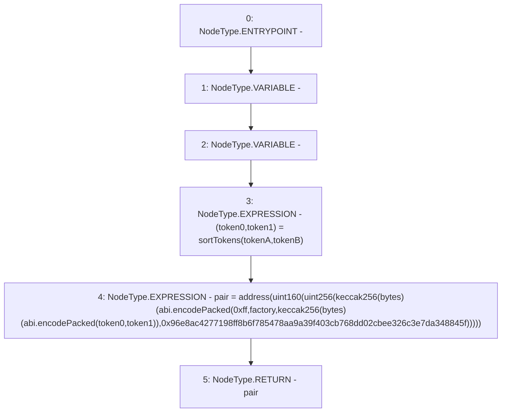

# Context: UniswapV2Library.pairFor

**Contract:** `UniswapV2Library` (Inherits: None)
**Signature:** `pairFor(address,address,address) returns (address)`
**Method Selector ID:** `Internal (No Method ID)`
**Visibility:** `internal`
**Environment-Free:** `Yes`
**Modifiers:** None

### State Variables Interaction
- **Reads:** None
- **Writes:** None

### Environment & Verification Flags
- **Uses Foundry Cheatcodes:** No
- **Has Echidna Properties:** No

### Internal Calls Tree
- None

### External Calls / Value Transfers
- None

### Control Flow Graph (CFG)


### Source Mapping
Declared in: `certora-ac-datasets/detasets/web3bugs/dataset/web3bugs/52/contracts/external/libraries/UniswapV2Library.sol` on lines **26** to **48**

```solidity
    function pairFor(
        address factory,
        address tokenA,
        address tokenB
    ) internal pure returns (address pair) {
        (address token0, address token1) = sortTokens(tokenA, tokenB);
        unchecked {
            pair = address(
                uint160(
                    uint256(
                        keccak256(
                            abi.encodePacked(
                                hex"ff",
                                factory,
                                keccak256(abi.encodePacked(token0, token1)),
                                hex"96e8ac4277198ff8b6f785478aa9a39f403cb768dd02cbee326c3e7da348845f" // init code hash
                            )
                        )
                    )
                )
            );
        }
    }

```
