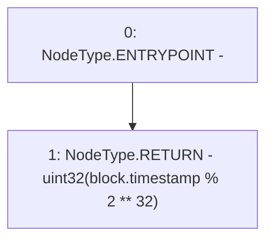

# Context: UniswapV2OracleLibrary.currentBlockTimestamp

**Contract:** `UniswapV2OracleLibrary` (Inherits: None)
**Signature:** `currentBlockTimestamp() returns (uint32)`
**Method Selector ID:** `Internal (No Method ID)`
**Visibility:** `internal`
**Environment-Free:** `No (reads EVM state context)`
**Modifiers:** None

### State Variables Interaction
- **Reads:** None
- **Writes:** None

### Environment & Verification Flags
- **Uses Foundry Cheatcodes:** No
- **Has Echidna Properties:** No

### Internal Calls Tree
- None

### External Calls / Value Transfers
- None

### Control Flow Graph (CFG)


### Source Mapping
Declared in: `certora-ac-datasets/detasets/web3bugs/dataset/web3bugs/52/contracts/external/libraries/UniswapV2OracleLibrary.sol` on lines **13** to **15**

```solidity
    function currentBlockTimestamp() internal view returns (uint32) {
        return uint32(block.timestamp % 2**32);
    }

```
