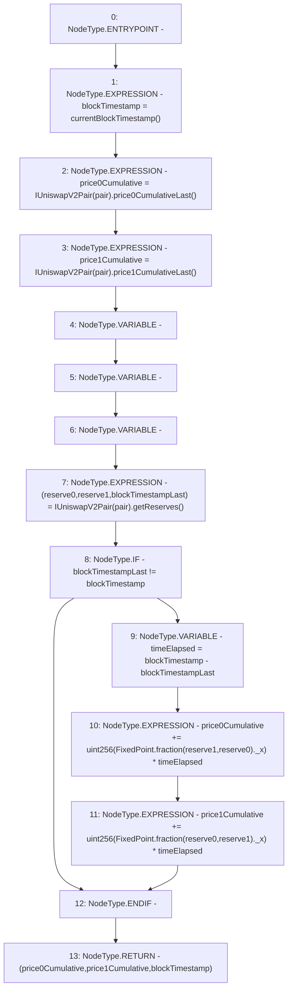

# Context: UniswapV2OracleLibrary.currentCumulativePrices

**Contract:** `UniswapV2OracleLibrary` (Inherits: None)
**Signature:** `currentCumulativePrices(address) returns (uint256, uint256, uint32)`
**Method Selector ID:** `Internal (No Method ID)`
**Visibility:** `internal`
**Environment-Free:** `No (reads EVM state context)`
**Modifiers:** None

### State Variables Interaction
- **Reads:** None
- **Writes:** None

### Environment & Verification Flags
- **Uses Foundry Cheatcodes:** No
- **Has Echidna Properties:** No

### Internal Calls Tree
- None

### External Calls / Value Transfers
- `FixedPoint.TMP_368(FixedPoint.uq112x112) = LIBRARY_CALL, dest:FixedPoint, function:FixedPoint.fraction(uint256,uint256), arguments:['reserve1', 'reserve0'] `
- `IUniswapV2Pair.TMP_364(uint256) = HIGH_LEVEL_CALL, dest:TMP_363(IUniswapV2Pair), function:price1CumulativeLast, arguments:[]  `
- `IUniswapV2Pair.TUPLE_6(uint112,uint112,uint32) = HIGH_LEVEL_CALL, dest:TMP_365(IUniswapV2Pair), function:getReserves, arguments:[]  `
- `FixedPoint.TMP_371(FixedPoint.uq112x112) = LIBRARY_CALL, dest:FixedPoint, function:FixedPoint.fraction(uint256,uint256), arguments:['reserve0', 'reserve1'] `
- `IUniswapV2Pair.TMP_362(uint256) = HIGH_LEVEL_CALL, dest:TMP_361(IUniswapV2Pair), function:price0CumulativeLast, arguments:[]  `

### Control Flow Graph (CFG)


### Source Mapping
Declared in: `certora-ac-datasets/detasets/web3bugs/dataset/web3bugs/52/contracts/external/libraries/UniswapV2OracleLibrary.sol` on lines **18** to **50**

```solidity
    function currentCumulativePrices(address pair)
        internal
        view
        returns (
            uint256 price0Cumulative,
            uint256 price1Cumulative,
            uint32 blockTimestamp
        )
    {
        blockTimestamp = currentBlockTimestamp();
        price0Cumulative = IUniswapV2Pair(pair).price0CumulativeLast();
        price1Cumulative = IUniswapV2Pair(pair).price1CumulativeLast();

        // if time has elapsed since the last update on the pair, mock the accumulated price values
        (
            uint112 reserve0,
            uint112 reserve1,
            uint32 blockTimestampLast
        ) = IUniswapV2Pair(pair).getReserves();
        if (blockTimestampLast != blockTimestamp) {
            // subtraction overflow is desired
            uint32 timeElapsed = blockTimestamp - blockTimestampLast;
            // addition overflow is desired
            // counterfactual
            price0Cumulative +=
                uint256(FixedPoint.fraction(reserve1, reserve0)._x) *
                timeElapsed;
            // counterfactual
            price1Cumulative +=
                uint256(FixedPoint.fraction(reserve0, reserve1)._x) *
                timeElapsed;
        }
    }

```
