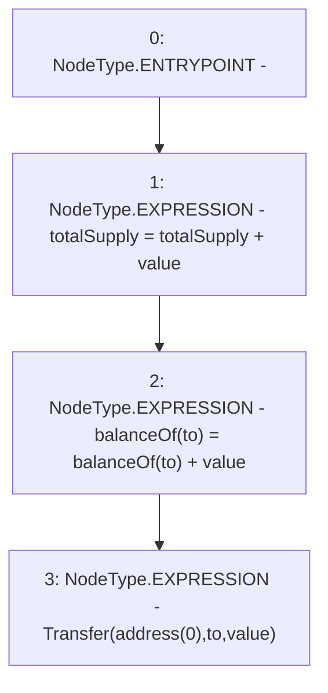

# Context: UniswapV2Pair._mint

**Contract:** `UniswapV2Pair` (Inherits: UniswapV2ERC20, IUniswapV2Pair, IUniswapV2ERC20)
**Signature:** `_mint(address,uint256)`
**Method Selector ID:** `Internal (No Method ID)`
**Visibility:** `internal`
**Environment-Free:** `Yes`
**Modifiers:** None

### State Variables Interaction
- **Reads:** balanceOf, totalSupply
- **Writes:** balanceOf, totalSupply

### Environment & Verification Flags
- **Uses Foundry Cheatcodes:** No
- **Has Echidna Properties:** No

### Internal Calls Tree
- None

### External Calls / Value Transfers
- None

### Control Flow Graph (CFG)


### Source Mapping
Declared in: `certora-ac-datasets/detasets/web3bugs/dataset/web3bugs/52/contracts/external/UniswapV2ERC20.sol` on lines **39** to **43**

```solidity
    function _mint(address to, uint256 value) internal {
        totalSupply = totalSupply + value;
        balanceOf[to] = balanceOf[to] + value;
        emit Transfer(address(0), to, value);
    }

```
