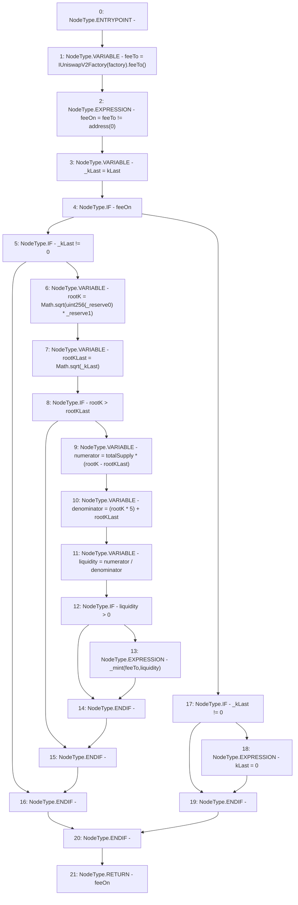

# Context: UniswapV2Pair._mintFee

**Contract:** `UniswapV2Pair` (Inherits: UniswapV2ERC20, IUniswapV2Pair, IUniswapV2ERC20)
**Signature:** `_mintFee(uint112,uint112) returns (bool)`
**Method Selector ID:** `Internal (No Method ID)`
**Visibility:** `private`
**Environment-Free:** `Yes`
**Modifiers:** None

### State Variables Interaction
- **Reads:** factory, kLast, totalSupply
- **Writes:** kLast

### Environment & Verification Flags
- **Uses Foundry Cheatcodes:** No
- **Has Echidna Properties:** No

### Internal Calls Tree
- None

### External Calls / Value Transfers
- `Math.TMP_127(uint256) = LIBRARY_CALL, dest:Math, function:Math.sqrt(uint256), arguments:['TMP_126'] `
- `IUniswapV2Factory.TMP_121(address) = HIGH_LEVEL_CALL, dest:TMP_120(IUniswapV2Factory), function:feeTo, arguments:[]  `
- `Math.TMP_128(uint256) = LIBRARY_CALL, dest:Math, function:Math.sqrt(uint256), arguments:['_kLast'] `

### Control Flow Graph (CFG)


### Source Mapping
Declared in: `certora-ac-datasets/detasets/web3bugs/dataset/web3bugs/52/contracts/external/UniswapV2Pair.sol` on lines **108** to **129**

```solidity
    function _mintFee(uint112 _reserve0, uint112 _reserve1)
        private
        returns (bool feeOn)
    {
        address feeTo = IUniswapV2Factory(factory).feeTo();
        feeOn = feeTo != address(0);
        uint256 _kLast = kLast; // gas savings
        if (feeOn) {
            if (_kLast != 0) {
                uint256 rootK = Math.sqrt(uint256(_reserve0) * _reserve1);
                uint256 rootKLast = Math.sqrt(_kLast);
                if (rootK > rootKLast) {
                    uint256 numerator = totalSupply * (rootK - rootKLast);
                    uint256 denominator = (rootK * 5) + rootKLast;
                    uint256 liquidity = numerator / denominator;
                    if (liquidity > 0) _mint(feeTo, liquidity);
                }
            }
        } else if (_kLast != 0) {
            kLast = 0;
        }
    }

```
