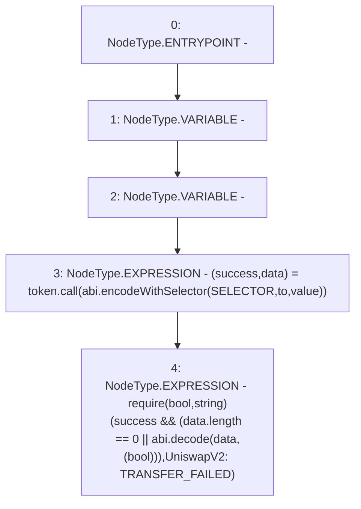

# Context: UniswapV2Pair._safeTransfer

**Contract:** `UniswapV2Pair` (Inherits: UniswapV2ERC20, IUniswapV2Pair, IUniswapV2ERC20)
**Signature:** `_safeTransfer(address,address,uint256)`
**Method Selector ID:** `Internal (No Method ID)`
**Visibility:** `private`
**Environment-Free:** `Yes`
**Modifiers:** None

### State Variables Interaction
- **Reads:** SELECTOR
- **Writes:** None

### Assertion Checks & Business Requirements
- require/assert: `require(bool,string)(success && (data.length == 0 || abi.decode(data,(bool))),UniswapV2: TRANSFER_FAILED)`

### Environment & Verification Flags
- **Uses Foundry Cheatcodes:** No
- **Has Echidna Properties:** No

### Internal Calls Tree
- None

### External Calls / Value Transfers
- `low-level-call`

### Control Flow Graph (CFG)


### Source Mapping
Declared in: `certora-ac-datasets/detasets/web3bugs/dataset/web3bugs/52/contracts/external/UniswapV2Pair.sol` on lines **54** to **66**

```solidity
    function _safeTransfer(
        address token,
        address to,
        uint256 value
    ) private {
        (bool success, bytes memory data) = token.call(
            abi.encodeWithSelector(SELECTOR, to, value)
        );
        require(
            success && (data.length == 0 || abi.decode(data, (bool))),
            "UniswapV2: TRANSFER_FAILED"
        );
    }

```
