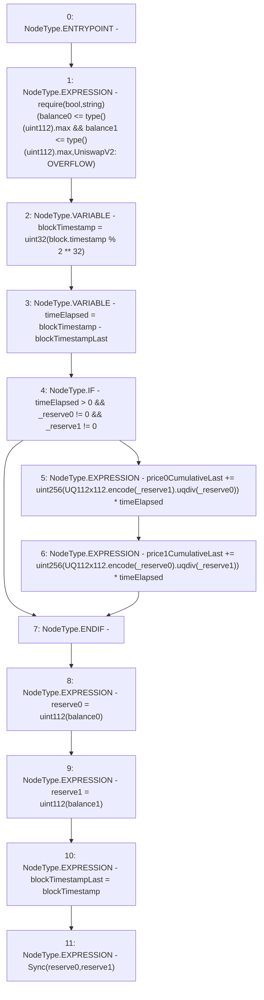

# Context: UniswapV2Pair._update

**Contract:** `UniswapV2Pair` (Inherits: UniswapV2ERC20, IUniswapV2Pair, IUniswapV2ERC20)
**Signature:** `_update(uint256,uint256,uint112,uint112)`
**Method Selector ID:** `Internal (No Method ID)`
**Visibility:** `private`
**Environment-Free:** `No (reads EVM state context)`
**Modifiers:** None

### State Variables Interaction
- **Reads:** blockTimestampLast, price0CumulativeLast, price1CumulativeLast, reserve0, reserve1
- **Writes:** blockTimestampLast, price0CumulativeLast, price1CumulativeLast, reserve0, reserve1

### Assertion Checks & Business Requirements
- require/assert: `require(bool,string)(balance0 <= type()(uint112).max && balance1 <= type()(uint112).max,UniswapV2: OVERFLOW)`

### Environment & Verification Flags
- **Uses Foundry Cheatcodes:** No
- **Has Echidna Properties:** No

### Internal Calls Tree
- None

### External Calls / Value Transfers
- `UQ112x112.TMP_109(uint224) = LIBRARY_CALL, dest:UQ112x112, function:UQ112x112.encode(uint112), arguments:['_reserve1'] `
- `UQ112x112.TMP_113(uint224) = LIBRARY_CALL, dest:UQ112x112, function:UQ112x112.encode(uint112), arguments:['_reserve0'] `
- `UQ112x112.TMP_114(uint224) = LIBRARY_CALL, dest:UQ112x112, function:UQ112x112.uqdiv(uint224,uint112), arguments:['TMP_113', '_reserve1'] `
- `UQ112x112.TMP_110(uint224) = LIBRARY_CALL, dest:UQ112x112, function:UQ112x112.uqdiv(uint224,uint112), arguments:['TMP_109', '_reserve0'] `

### Control Flow Graph (CFG)


### Source Mapping
Declared in: `certora-ac-datasets/detasets/web3bugs/dataset/web3bugs/52/contracts/external/UniswapV2Pair.sol` on lines **80** to **105**

```solidity
    function _update(
        uint256 balance0,
        uint256 balance1,
        uint112 _reserve0,
        uint112 _reserve1
    ) private {
        require(
            balance0 <= type(uint112).max && balance1 <= type(uint112).max,
            "UniswapV2: OVERFLOW"
        );
        uint32 blockTimestamp = uint32(block.timestamp % 2**32);
        uint32 timeElapsed = blockTimestamp - blockTimestampLast; // overflow is desired
        if (timeElapsed > 0 && _reserve0 != 0 && _reserve1 != 0) {
            // * never overflows, and + overflow is desired
            price0CumulativeLast +=
                uint256(UQ112x112.encode(_reserve1).uqdiv(_reserve0)) *
                timeElapsed;
            price1CumulativeLast +=
                uint256(UQ112x112.encode(_reserve0).uqdiv(_reserve1)) *
                timeElapsed;
        }
        reserve0 = uint112(balance0);
        reserve1 = uint112(balance1);
        blockTimestampLast = blockTimestamp;
        emit Sync(reserve0, reserve1);
    }

```
