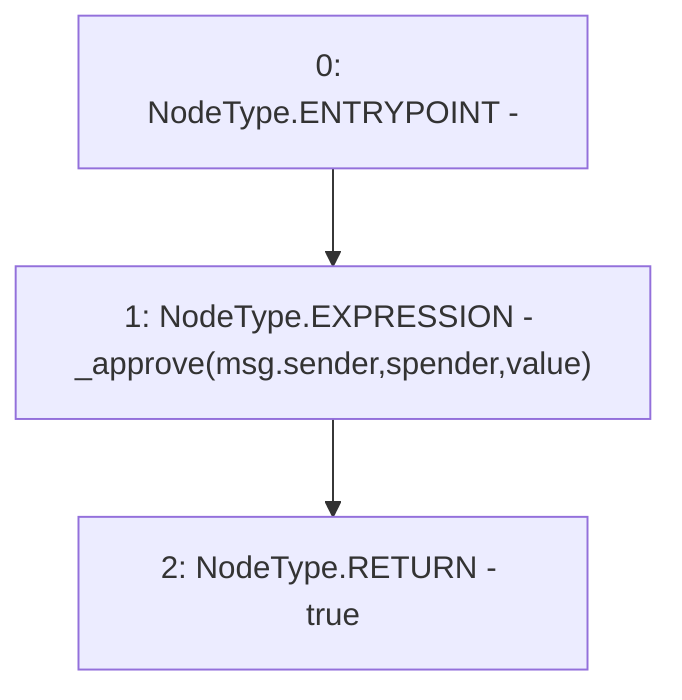

# Context: UniswapV2Pair.approve

**Contract:** `UniswapV2Pair` (Inherits: UniswapV2ERC20, IUniswapV2Pair, IUniswapV2ERC20)
**Signature:** `approve(address,uint256) returns (bool)`
**Method Selector ID:** `0x095ea7b3`
**Visibility:** `external`
**Environment-Free:** `No (reads EVM state context)`
**Modifiers:** None

### State Variables Interaction
- **Reads:** None
- **Writes:** None

### Environment & Verification Flags
- **Uses Foundry Cheatcodes:** No
- **Has Echidna Properties:** No

### Internal Calls Tree
- None

### External Calls / Value Transfers
- None

### Control Flow Graph (CFG)


### Source Mapping
Declared in: `certora-ac-datasets/detasets/web3bugs/dataset/web3bugs/52/contracts/external/UniswapV2ERC20.sol` on lines **70** to **73**

```solidity
    function approve(address spender, uint256 value) external returns (bool) {
        _approve(msg.sender, spender, value);
        return true;
    }

```
