# Context: UniswapV2Pair.burn

**Contract:** `UniswapV2Pair` (Inherits: UniswapV2ERC20, IUniswapV2Pair, IUniswapV2ERC20)
**Signature:** `burn(address) returns (uint256, uint256)`
**Method Selector ID:** `0x89afcb44`
**Visibility:** `external`
**Environment-Free:** `No (reads EVM state context)`
**Modifiers:**
- `lock`
  ```solidity
  modifier lock() {
          require(unlocked == 1, "UniswapV2: LOCKED");
          unlocked = 0;
          _;
          unlocked = 1;
      }
  ```

### State Variables Interaction
- **Reads:** balanceOf, reserve0, reserve1, token0, token1, totalSupply
- **Writes:** kLast

### Assertion Checks & Business Requirements
- require/assert: `require(bool,string)(amount0 > 0 && amount1 > 0,UniswapV2: INSUFFICIENT_LIQUIDITY_BURNED)`

### Environment & Verification Flags
- **Uses Foundry Cheatcodes:** No
- **Has Echidna Properties:** No

### Internal Calls Tree
- None

### External Calls / Value Transfers
- `IERC20.TMP_168(uint256) = HIGH_LEVEL_CALL, dest:TMP_166(IERC20), function:balanceOf, arguments:['TMP_167']  `
- `IERC20.TMP_171(uint256) = HIGH_LEVEL_CALL, dest:TMP_169(IERC20), function:balanceOf, arguments:['TMP_170']  `
- `IERC20.TMP_188(uint256) = HIGH_LEVEL_CALL, dest:TMP_186(IERC20), function:balanceOf, arguments:['TMP_187']  `
- `IERC20.TMP_191(uint256) = HIGH_LEVEL_CALL, dest:TMP_189(IERC20), function:balanceOf, arguments:['TMP_190']  `

### Control Flow Graph (CFG)

```mermaid
flowchart TD
    Node_0["0: NodeType.ENTRYPOINT - "]
    Node_0 --> Node_24
    Node_1["1: NodeType.VARIABLE - "]
    Node_1 --> Node_2
    Node_2["2: NodeType.VARIABLE - "]
    Node_2 --> Node_3
    Node_3["3: NodeType.EXPRESSION - (_reserve0,_reserve1,None) = getReserves()"]
    Node_3 --> Node_4
    Node_4["4: NodeType.VARIABLE - _token0 = token0"]
    Node_4 --> Node_5
    Node_5["5: NodeType.VARIABLE - _token1 = token1"]
    Node_5 --> Node_6
    Node_6["6: NodeType.VARIABLE - balance0 = IERC20(_token0).balanceOf(address(this))"]
    Node_6 --> Node_7
    Node_7["7: NodeType.VARIABLE - balance1 = IERC20(_token1).balanceOf(address(this))"]
    Node_7 --> Node_8
    Node_8["8: NodeType.VARIABLE - liquidity = balanceOf(address(this))"]
    Node_8 --> Node_9
    Node_9["9: NodeType.VARIABLE - feeOn = _mintFee(_reserve0,_reserve1)"]
    Node_9 --> Node_10
    Node_10["10: NodeType.VARIABLE - _totalSupply = totalSupply"]
    Node_10 --> Node_11
    Node_11["11: NodeType.EXPRESSION - amount0 = (liquidity * balance0) / _totalSupply"]
    Node_11 --> Node_12
    Node_12["12: NodeType.EXPRESSION - amount1 = (liquidity * balance1) / _totalSupply"]
    Node_12 --> Node_13
    Node_13["13: NodeType.EXPRESSION - require(bool,string)(amount0 > 0 && amount1 > 0,UniswapV2: INSUFFICIENT_LIQUIDITY_BURNED)"]
    Node_13 --> Node_14
    Node_14["14: NodeType.EXPRESSION - _burn(address(this),liquidity)"]
    Node_14 --> Node_15
    Node_15["15: NodeType.EXPRESSION - _safeTransfer(_token0,to,amount0)"]
    Node_15 --> Node_16
    Node_16["16: NodeType.EXPRESSION - _safeTransfer(_token1,to,amount1)"]
    Node_16 --> Node_17
    Node_17["17: NodeType.EXPRESSION - balance0 = IERC20(_token0).balanceOf(address(this))"]
    Node_17 --> Node_18
    Node_18["18: NodeType.EXPRESSION - balance1 = IERC20(_token1).balanceOf(address(this))"]
    Node_18 --> Node_19
    Node_19["19: NodeType.EXPRESSION - _update(balance0,balance1,_reserve0,_reserve1)"]
    Node_19 --> Node_20
    Node_20["20: NodeType.IF - feeOn"]
    Node_20 --> Node_21
    Node_20 --> Node_22
    Node_21["21: NodeType.EXPRESSION - kLast = uint256(reserve0) * reserve1"]
    Node_21 --> Node_22
    Node_22["22: NodeType.ENDIF - "]
    Node_22 --> Node_23
    Node_23["23: NodeType.EXPRESSION - Burn(msg.sender,amount0,amount1,to)"]
    Node_23 --> Node_25
    Node_24["24: NodeType.EXPRESSION - lock()"]
    Node_24 --> Node_1
    Node_25["25: NodeType.RETURN - (amount0,amount1)"]
```


### Source Mapping
Declared in: `certora-ac-datasets/detasets/web3bugs/dataset/web3bugs/52/contracts/external/UniswapV2Pair.sol` on lines **159** to **188**

```solidity
    function burn(address to)
        external
        lock
        returns (uint256 amount0, uint256 amount1)
    {
        (uint112 _reserve0, uint112 _reserve1, ) = getReserves(); // gas savings
        address _token0 = token0; // gas savings
        address _token1 = token1; // gas savings
        uint256 balance0 = IERC20(_token0).balanceOf(address(this));
        uint256 balance1 = IERC20(_token1).balanceOf(address(this));
        uint256 liquidity = balanceOf[address(this)];

        bool feeOn = _mintFee(_reserve0, _reserve1);
        uint256 _totalSupply = totalSupply; // gas savings, must be defined here since totalSupply can update in _mintFee
        amount0 = (liquidity * balance0) / _totalSupply; // using balances ensures pro-rata distribution
        amount1 = (liquidity * balance1) / _totalSupply; // using balances ensures pro-rata distribution
        require(
            amount0 > 0 && amount1 > 0,
            "UniswapV2: INSUFFICIENT_LIQUIDITY_BURNED"
        );
        _burn(address(this), liquidity);
        _safeTransfer(_token0, to, amount0);
        _safeTransfer(_token1, to, amount1);
        balance0 = IERC20(_token0).balanceOf(address(this));
        balance1 = IERC20(_token1).balanceOf(address(this));

        _update(balance0, balance1, _reserve0, _reserve1);
        if (feeOn) kLast = uint256(reserve0) * reserve1; // reserve0 and reserve1 are up-to-date
        emit Burn(msg.sender, amount0, amount1, to);
    }

```
