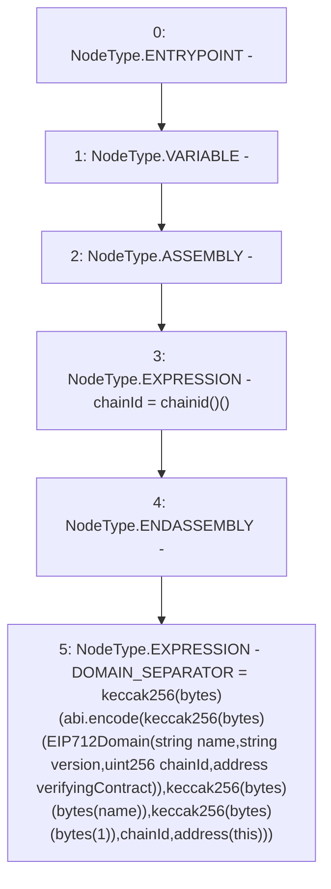

# Context: UniswapV2Pair.constructor

**Contract:** `UniswapV2Pair` (Inherits: UniswapV2ERC20, IUniswapV2Pair, IUniswapV2ERC20)
**Signature:** `constructor()`
**Method Selector ID:** `0x90fa17bb`
**Visibility:** `public`
**Environment-Free:** `Yes`
**Modifiers:** None

### State Variables Interaction
- **Reads:** name
- **Writes:** DOMAIN_SEPARATOR

### Environment & Verification Flags
- **Uses Foundry Cheatcodes:** No
- **Has Echidna Properties:** No

### Internal Calls Tree
- None

### External Calls / Value Transfers
- None

### Control Flow Graph (CFG)


### Source Mapping
Declared in: `certora-ac-datasets/detasets/web3bugs/dataset/web3bugs/52/contracts/external/UniswapV2ERC20.sol` on lines **21** to **37**

```solidity
    constructor() {
        uint256 chainId;
        assembly {
            chainId := chainid()
        }
        DOMAIN_SEPARATOR = keccak256(
            abi.encode(
                keccak256(
                    "EIP712Domain(string name,string version,uint256 chainId,address verifyingContract)"
                ),
                keccak256(bytes(name)),
                keccak256(bytes("1")),
                chainId,
                address(this)
            )
        );
    }

```
