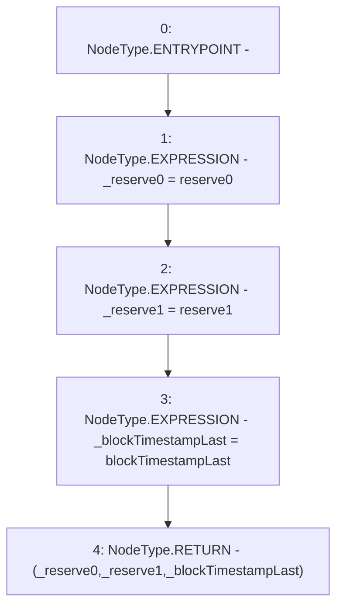

# Context: UniswapV2Pair.getReserves

**Contract:** `UniswapV2Pair` (Inherits: UniswapV2ERC20, IUniswapV2Pair, IUniswapV2ERC20)
**Signature:** `getReserves() returns (uint112, uint112, uint32)`
**Method Selector ID:** `0x0902f1ac`
**Visibility:** `public`
**Environment-Free:** `Yes`
**Modifiers:** None

### State Variables Interaction
- **Reads:** blockTimestampLast, reserve0, reserve1
- **Writes:** None

### Environment & Verification Flags
- **Uses Foundry Cheatcodes:** No
- **Has Echidna Properties:** No

### Internal Calls Tree
- None

### External Calls / Value Transfers
- None

### Control Flow Graph (CFG)


### Source Mapping
Declared in: `certora-ac-datasets/detasets/web3bugs/dataset/web3bugs/52/contracts/external/UniswapV2Pair.sol` on lines **40** to **52**

```solidity
    function getReserves()
        public
        view
        returns (
            uint112 _reserve0,
            uint112 _reserve1,
            uint32 _blockTimestampLast
        )
    {
        _reserve0 = reserve0;
        _reserve1 = reserve1;
        _blockTimestampLast = blockTimestampLast;
    }

```
