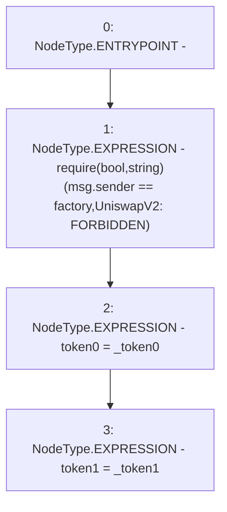

# Context: UniswapV2Pair.initialize

**Contract:** `UniswapV2Pair` (Inherits: UniswapV2ERC20, IUniswapV2Pair, IUniswapV2ERC20)
**Signature:** `initialize(address,address)`
**Method Selector ID:** `0x485cc955`
**Visibility:** `external`
**Environment-Free:** `No (reads EVM state context)`
**Modifiers:** None

### State Variables Interaction
- **Reads:** factory
- **Writes:** token0, token1

### Assertion Checks & Business Requirements
- require/assert: `require(bool,string)(msg.sender == factory,UniswapV2: FORBIDDEN)`

### Environment & Verification Flags
- **Uses Foundry Cheatcodes:** No
- **Has Echidna Properties:** No

### Internal Calls Tree
- None

### External Calls / Value Transfers
- None

### Control Flow Graph (CFG)


### Source Mapping
Declared in: `certora-ac-datasets/detasets/web3bugs/dataset/web3bugs/52/contracts/external/UniswapV2Pair.sol` on lines **73** to **77**

```solidity
    function initialize(address _token0, address _token1) external {
        require(msg.sender == factory, "UniswapV2: FORBIDDEN"); // sufficient check
        token0 = _token0;
        token1 = _token1;
    }

```
