# Context: UniswapV2Pair.mint

**Contract:** `UniswapV2Pair` (Inherits: UniswapV2ERC20, IUniswapV2Pair, IUniswapV2ERC20)
**Signature:** `mint(address) returns (uint256)`
**Method Selector ID:** `0x6a627842`
**Visibility:** `external`
**Environment-Free:** `No (reads EVM state context)`
**Modifiers:**
- `lock`
  ```solidity
  modifier lock() {
          require(unlocked == 1, "UniswapV2: LOCKED");
          unlocked = 0;
          _;
          unlocked = 1;
      }
  ```

### State Variables Interaction
- **Reads:** MINIMUM_LIQUIDITY, reserve0, reserve1, token0, token1, totalSupply
- **Writes:** kLast

### Assertion Checks & Business Requirements
- require/assert: `require(bool,string)(liquidity > 0,UniswapV2: INSUFFICIENT_LIQUIDITY_MINTED)`

### Environment & Verification Flags
- **Uses Foundry Cheatcodes:** No
- **Has Echidna Properties:** No

### Internal Calls Tree
- None

### External Calls / Value Transfers
- `Math.TMP_149(uint256) = LIBRARY_CALL, dest:Math, function:Math.sqrt(uint256), arguments:['TMP_148'] `
- `IERC20.TMP_140(uint256) = HIGH_LEVEL_CALL, dest:TMP_138(IERC20), function:balanceOf, arguments:['TMP_139']  `
- `IERC20.TMP_143(uint256) = HIGH_LEVEL_CALL, dest:TMP_141(IERC20), function:balanceOf, arguments:['TMP_142']  `
- `Math.TMP_157(uint256) = LIBRARY_CALL, dest:Math, function:Math.min(uint256,uint256), arguments:['TMP_154', 'TMP_156'] `

### Control Flow Graph (CFG)

```mermaid
flowchart TD
    Node_0["0: NodeType.ENTRYPOINT - "]
    Node_0 --> Node_22
    Node_1["1: NodeType.VARIABLE - "]
    Node_1 --> Node_2
    Node_2["2: NodeType.VARIABLE - "]
    Node_2 --> Node_3
    Node_3["3: NodeType.EXPRESSION - (_reserve0,_reserve1,None) = getReserves()"]
    Node_3 --> Node_4
    Node_4["4: NodeType.VARIABLE - balance0 = IERC20(token0).balanceOf(address(this))"]
    Node_4 --> Node_5
    Node_5["5: NodeType.VARIABLE - balance1 = IERC20(token1).balanceOf(address(this))"]
    Node_5 --> Node_6
    Node_6["6: NodeType.VARIABLE - amount0 = balance0 - _reserve0"]
    Node_6 --> Node_7
    Node_7["7: NodeType.VARIABLE - amount1 = balance1 - _reserve1"]
    Node_7 --> Node_8
    Node_8["8: NodeType.VARIABLE - feeOn = _mintFee(_reserve0,_reserve1)"]
    Node_8 --> Node_9
    Node_9["9: NodeType.VARIABLE - _totalSupply = totalSupply"]
    Node_9 --> Node_10
    Node_10["10: NodeType.IF - _totalSupply == 0"]
    Node_10 --> Node_11
    Node_10 --> Node_13
    Node_11["11: NodeType.EXPRESSION - liquidity = Math.sqrt(amount0 * amount1) - MINIMUM_LIQUIDITY"]
    Node_11 --> Node_12
    Node_12["12: NodeType.EXPRESSION - _mint(address(0),MINIMUM_LIQUIDITY)"]
    Node_12 --> Node_14
    Node_13["13: NodeType.EXPRESSION - liquidity = Math.min((amount0 * (_totalSupply)) / _reserve0,(amount1 * (_totalSupply)) / _reserve1)"]
    Node_13 --> Node_14
    Node_14["14: NodeType.ENDIF - "]
    Node_14 --> Node_15
    Node_15["15: NodeType.EXPRESSION - require(bool,string)(liquidity > 0,UniswapV2: INSUFFICIENT_LIQUIDITY_MINTED)"]
    Node_15 --> Node_16
    Node_16["16: NodeType.EXPRESSION - _mint(to,liquidity)"]
    Node_16 --> Node_17
    Node_17["17: NodeType.EXPRESSION - _update(balance0,balance1,_reserve0,_reserve1)"]
    Node_17 --> Node_18
    Node_18["18: NodeType.IF - feeOn"]
    Node_18 --> Node_19
    Node_18 --> Node_20
    Node_19["19: NodeType.EXPRESSION - kLast = uint256(reserve0) * reserve1"]
    Node_19 --> Node_20
    Node_20["20: NodeType.ENDIF - "]
    Node_20 --> Node_21
    Node_21["21: NodeType.EXPRESSION - Mint(msg.sender,amount0,amount1)"]
    Node_21 --> Node_23
    Node_22["22: NodeType.EXPRESSION - lock()"]
    Node_22 --> Node_1
    Node_23["23: NodeType.RETURN - liquidity"]
```


### Source Mapping
Declared in: `certora-ac-datasets/detasets/web3bugs/dataset/web3bugs/52/contracts/external/UniswapV2Pair.sol` on lines **132** to **156**

```solidity
    function mint(address to) external lock returns (uint256 liquidity) {
        (uint112 _reserve0, uint112 _reserve1, ) = getReserves(); // gas savings
        uint256 balance0 = IERC20(token0).balanceOf(address(this));
        uint256 balance1 = IERC20(token1).balanceOf(address(this));
        uint256 amount0 = balance0 - _reserve0;
        uint256 amount1 = balance1 - _reserve1;

        bool feeOn = _mintFee(_reserve0, _reserve1);
        uint256 _totalSupply = totalSupply; // gas savings, must be defined here since totalSupply can update in _mintFee
        if (_totalSupply == 0) {
            liquidity = Math.sqrt(amount0 * amount1) - MINIMUM_LIQUIDITY;
            _mint(address(0), MINIMUM_LIQUIDITY); // permanently lock the first MINIMUM_LIQUIDITY tokens
        } else {
            liquidity = Math.min(
                (amount0 * (_totalSupply)) / _reserve0,
                (amount1 * (_totalSupply)) / _reserve1
            );
        }
        require(liquidity > 0, "UniswapV2: INSUFFICIENT_LIQUIDITY_MINTED");
        _mint(to, liquidity);

        _update(balance0, balance1, _reserve0, _reserve1);
        if (feeOn) kLast = uint256(reserve0) * reserve1; // reserve0 and reserve1 are up-to-date
        emit Mint(msg.sender, amount0, amount1);
    }

```
