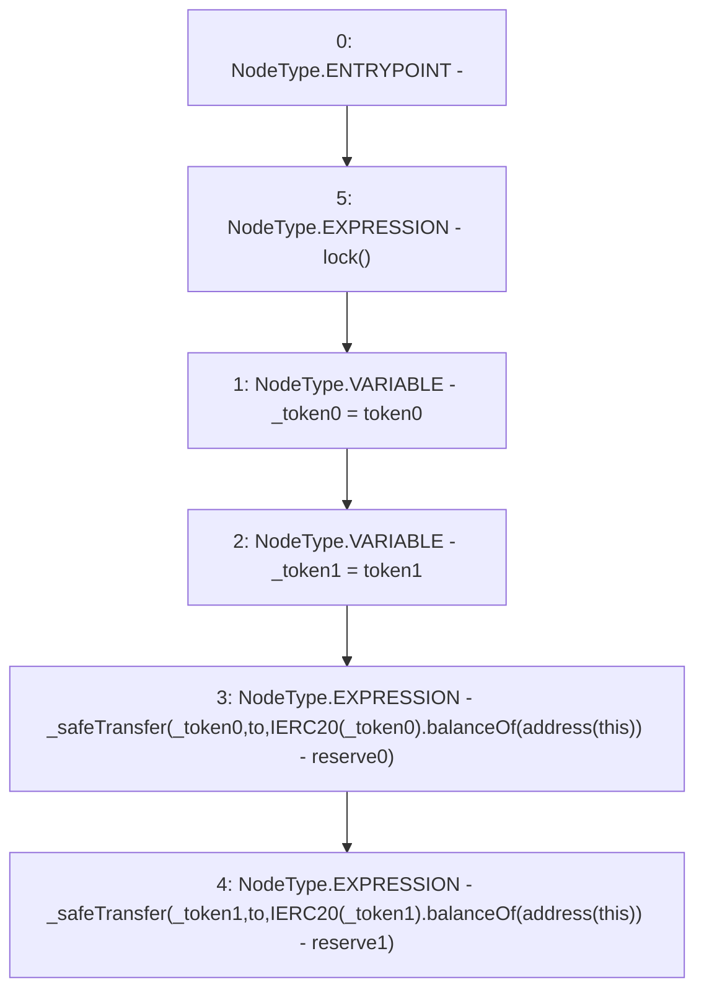

# Context: UniswapV2Pair.skim

**Contract:** `UniswapV2Pair` (Inherits: UniswapV2ERC20, IUniswapV2Pair, IUniswapV2ERC20)
**Signature:** `skim(address)`
**Method Selector ID:** `0xbc25cf77`
**Visibility:** `external`
**Environment-Free:** `Yes`
**Modifiers:**
- `lock`
  ```solidity
  modifier lock() {
          require(unlocked == 1, "UniswapV2: LOCKED");
          unlocked = 0;
          _;
          unlocked = 1;
      }
  ```

### State Variables Interaction
- **Reads:** reserve0, reserve1, token0, token1
- **Writes:** None

### Environment & Verification Flags
- **Uses Foundry Cheatcodes:** No
- **Has Echidna Properties:** No

### Internal Calls Tree
- None

### External Calls / Value Transfers
- `IERC20.TMP_252(uint256) = HIGH_LEVEL_CALL, dest:TMP_250(IERC20), function:balanceOf, arguments:['TMP_251']  `
- `IERC20.TMP_257(uint256) = HIGH_LEVEL_CALL, dest:TMP_255(IERC20), function:balanceOf, arguments:['TMP_256']  `

### Control Flow Graph (CFG)


### Source Mapping
Declared in: `certora-ac-datasets/detasets/web3bugs/dataset/web3bugs/52/contracts/external/UniswapV2Pair.sol` on lines **252** to **265**

```solidity
    function skim(address to) external lock {
        address _token0 = token0; // gas savings
        address _token1 = token1; // gas savings
        _safeTransfer(
            _token0,
            to,
            IERC20(_token0).balanceOf(address(this)) - reserve0
        );
        _safeTransfer(
            _token1,
            to,
            IERC20(_token1).balanceOf(address(this)) - reserve1
        );
    }

```
