# Context: UniswapV2Pair.swap

**Contract:** `UniswapV2Pair` (Inherits: UniswapV2ERC20, IUniswapV2Pair, IUniswapV2ERC20)
**Signature:** `swap(uint256,uint256,address,bytes)`
**Method Selector ID:** `0x022c0d9f`
**Visibility:** `external`
**Environment-Free:** `No (reads EVM state context)`
**Modifiers:**
- `lock`
  ```solidity
  modifier lock() {
          require(unlocked == 1, "UniswapV2: LOCKED");
          unlocked = 0;
          _;
          unlocked = 1;
      }
  ```

### State Variables Interaction
- **Reads:** token0, token1
- **Writes:** None

### Assertion Checks & Business Requirements
- require/assert: `require(bool,string)(amount0Out > 0 || amount1Out > 0,UniswapV2: INSUFFICIENT_OUTPUT_AMOUNT)`
- require/assert: `require(bool,string)(amount0Out < _reserve0 && amount1Out < _reserve1,UniswapV2: INSUFFICIENT_LIQUIDITY)`
- require/assert: `require(bool,string)(to != _token0 && to != _token1,UniswapV2: INVALID_TO)`
- require/assert: `require(bool,string)(amount0In > 0 || amount1In > 0,UniswapV2: INSUFFICIENT_INPUT_AMOUNT)`
- require/assert: `require(bool,string)(balance0Adjusted * balance1Adjusted >= uint256(_reserve0) * _reserve1 * 1000 ** 2,UniswapV2: K)`

### Environment & Verification Flags
- **Uses Foundry Cheatcodes:** No
- **Has Echidna Properties:** No

### Internal Calls Tree
- None

### External Calls / Value Transfers
- `IERC20.TMP_221(uint256) = HIGH_LEVEL_CALL, dest:TMP_219(IERC20), function:balanceOf, arguments:['TMP_220']  `
- `IUniswapV2Callee.HIGH_LEVEL_CALL, dest:TMP_214(IUniswapV2Callee), function:uniswapV2Call, arguments:['msg.sender', 'amount0Out', 'amount1Out', 'data']  `
- `IERC20.TMP_218(uint256) = HIGH_LEVEL_CALL, dest:TMP_216(IERC20), function:balanceOf, arguments:['TMP_217']  `

### Control Flow Graph (CFG)

```mermaid
flowchart TD
    Node_0["0: NodeType.ENTRYPOINT - "]
    Node_0 --> Node_30
    Node_1["1: NodeType.EXPRESSION - require(bool,string)(amount0Out > 0 || amount1Out > 0,UniswapV2: INSUFFICIENT_OUTPUT_AMOUNT)"]
    Node_1 --> Node_2
    Node_2["2: NodeType.VARIABLE - "]
    Node_2 --> Node_3
    Node_3["3: NodeType.VARIABLE - "]
    Node_3 --> Node_4
    Node_4["4: NodeType.EXPRESSION - (_reserve0,_reserve1,None) = getReserves()"]
    Node_4 --> Node_5
    Node_5["5: NodeType.EXPRESSION - require(bool,string)(amount0Out < _reserve0 && amount1Out < _reserve1,UniswapV2: INSUFFICIENT_LIQUIDITY)"]
    Node_5 --> Node_6
    Node_6["6: NodeType.VARIABLE - "]
    Node_6 --> Node_7
    Node_7["7: NodeType.VARIABLE - "]
    Node_7 --> Node_8
    Node_8["8: NodeType.VARIABLE - _token0 = token0"]
    Node_8 --> Node_9
    Node_9["9: NodeType.VARIABLE - _token1 = token1"]
    Node_9 --> Node_10
    Node_10["10: NodeType.EXPRESSION - require(bool,string)(to != _token0 && to != _token1,UniswapV2: INVALID_TO)"]
    Node_10 --> Node_11
    Node_11["11: NodeType.IF - amount0Out > 0"]
    Node_11 --> Node_12
    Node_11 --> Node_13
    Node_12["12: NodeType.EXPRESSION - _safeTransfer(_token0,to,amount0Out)"]
    Node_12 --> Node_13
    Node_13["13: NodeType.ENDIF - "]
    Node_13 --> Node_14
    Node_14["14: NodeType.IF - amount1Out > 0"]
    Node_14 --> Node_15
    Node_14 --> Node_16
    Node_15["15: NodeType.EXPRESSION - _safeTransfer(_token1,to,amount1Out)"]
    Node_15 --> Node_16
    Node_16["16: NodeType.ENDIF - "]
    Node_16 --> Node_17
    Node_17["17: NodeType.IF - data.length > 0"]
    Node_17 --> Node_18
    Node_17 --> Node_19
    Node_18["18: NodeType.EXPRESSION - IUniswapV2Callee(to).uniswapV2Call(msg.sender,amount0Out,amount1Out,data)"]
    Node_18 --> Node_19
    Node_19["19: NodeType.ENDIF - "]
    Node_19 --> Node_20
    Node_20["20: NodeType.EXPRESSION - balance0 = IERC20(_token0).balanceOf(address(this))"]
    Node_20 --> Node_21
    Node_21["21: NodeType.EXPRESSION - balance1 = IERC20(_token1).balanceOf(address(this))"]
    Node_21 --> Node_31
    Node_24["24: NodeType.EXPRESSION - require(bool,string)(amount0In > 0 || amount1In > 0,UniswapV2: INSUFFICIENT_INPUT_AMOUNT)"]
    Node_24 --> Node_25
    Node_25["25: NodeType.VARIABLE - balance0Adjusted = (balance0 * 1000) - (amount0In * 3)"]
    Node_25 --> Node_26
    Node_26["26: NodeType.VARIABLE - balance1Adjusted = (balance1 * 1000) - (amount1In * 3)"]
    Node_26 --> Node_27
    Node_27["27: NodeType.EXPRESSION - require(bool,string)(balance0Adjusted * balance1Adjusted >= uint256(_reserve0) * _reserve1 * 1000 ** 2,UniswapV2: K)"]
    Node_27 --> Node_28
    Node_28["28: NodeType.EXPRESSION - _update(balance0,balance1,_reserve0,_reserve1)"]
    Node_28 --> Node_29
    Node_29["29: NodeType.EXPRESSION - Swap(msg.sender,amount0In,amount1In,amount0Out,amount1Out,to)"]
    Node_30["30: NodeType.EXPRESSION - lock()"]
    Node_30 --> Node_1
    Node_31["31: NodeType.IF - balance0 > _reserve0 - amount0Out"]
    Node_31 --> Node_32
    Node_31 --> Node_33
    Node_32["32: NodeType.EXPRESSION - amount0In = balance0 - (_reserve0 - amount0Out)"]
    Node_32 --> Node_34
    Node_33["33: NodeType.EXPRESSION - amount0In = 0"]
    Node_33 --> Node_34
    Node_34["34: NodeType.ENDIF - "]
    Node_34 --> Node_35
    Node_35["35: NodeType.IF - balance1 > _reserve1 - amount1Out"]
    Node_35 --> Node_36
    Node_35 --> Node_37
    Node_36["36: NodeType.EXPRESSION - amount1In = balance1 - (_reserve1 - amount1Out)"]
    Node_36 --> Node_38
    Node_37["37: NodeType.EXPRESSION - amount1In = 0"]
    Node_37 --> Node_38
    Node_38["38: NodeType.ENDIF - "]
    Node_38 --> Node_24
```


### Source Mapping
Declared in: `certora-ac-datasets/detasets/web3bugs/dataset/web3bugs/52/contracts/external/UniswapV2Pair.sol` on lines **191** to **249**

```solidity
    function swap(
        uint256 amount0Out,
        uint256 amount1Out,
        address to,
        bytes calldata data
    ) external lock {
        require(
            amount0Out > 0 || amount1Out > 0,
            "UniswapV2: INSUFFICIENT_OUTPUT_AMOUNT"
        );
        (uint112 _reserve0, uint112 _reserve1, ) = getReserves(); // gas savings
        require(
            amount0Out < _reserve0 && amount1Out < _reserve1,
            "UniswapV2: INSUFFICIENT_LIQUIDITY"
        );

        uint256 balance0;
        uint256 balance1;
        {
            // scope for _token{0,1}, avoids stack too deep errors
            address _token0 = token0;
            address _token1 = token1;
            require(to != _token0 && to != _token1, "UniswapV2: INVALID_TO");
            if (amount0Out > 0) _safeTransfer(_token0, to, amount0Out); // optimistically transfer tokens
            if (amount1Out > 0) _safeTransfer(_token1, to, amount1Out); // optimistically transfer tokens
            if (data.length > 0)
                IUniswapV2Callee(to).uniswapV2Call(
                    msg.sender,
                    amount0Out,
                    amount1Out,
                    data
                );
            balance0 = IERC20(_token0).balanceOf(address(this));
            balance1 = IERC20(_token1).balanceOf(address(this));
        }
        uint256 amount0In = balance0 > _reserve0 - amount0Out
            ? balance0 - (_reserve0 - amount0Out)
            : 0;
        uint256 amount1In = balance1 > _reserve1 - amount1Out
            ? balance1 - (_reserve1 - amount1Out)
            : 0;
        require(
            amount0In > 0 || amount1In > 0,
            "UniswapV2: INSUFFICIENT_INPUT_AMOUNT"
        );
        {
            // scope for reserve{0,1}Adjusted, avoids stack too deep errors
            uint256 balance0Adjusted = (balance0 * 1000) - (amount0In * 3);
            uint256 balance1Adjusted = (balance1 * 1000) - (amount1In * 3);
            require(
                balance0Adjusted * balance1Adjusted >=
                    uint256(_reserve0) * _reserve1 * 1000**2,
                "UniswapV2: K"
            );
        }

        _update(balance0, balance1, _reserve0, _reserve1);
        emit Swap(msg.sender, amount0In, amount1In, amount0Out, amount1Out, to);
    }

```
